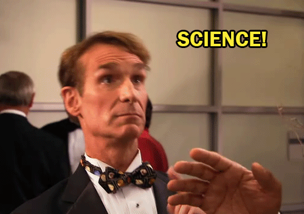

```{r setup, include=FALSE}
knitr::opts_chunk$set(echo = TRUE)
```

# Module 01


## Module 01 portfolio check

* Installation check
    + Completion status:
    + Comments:
* Portfolio repo setup
    + Completion status: 
    + Comments:
* RMarkdown Pretty html Challenge
    + Completion status:
    + Comments:
* Evidence worksheet_01
    + Completion status:
    + Comments:
* Evidence worksheet_02
    + Completion status:
    + Comments:
* Evidence worksheet_03
    + Completion status:
    + Comments:
* Problem Set_01
    + Completion status:
    + Comments:
* Problem Set_02
    + Completion status:
    + Comments:
* Writing assessment_01
    + Completion status:
    + Comments:
* Additional Readings
    + Completion status:
    + Comments  
    
## Data science Friday  


### Installation check


  

  

### Portfolio repo setup
Detail the code you used to create, initialize, and push your portfolio repo to GitHub. This will be helpful as you will need to repeat many of these steps to update your porfolio throughout the course.


`git add .`  
`git commit -m "type message"`  
`git push`  

### RMarkdown pretty html challenge
Paste your code from the in-class activity of recreating the example html.

* [R Markdown PDF Challenge] [R Markdown PDF Challenge ]
    + [Challenge Goals] [Challenge Goals]
        + [Here's a header!] [Here's a header!]  
        + [Table Time]  [Table Time]

# R Markdown PDF Challenge 

The following assignment is an exercise for the reproduction of this .html document using the RStudio and RMarkdown tools we’ve shown you in class. Hopefully by the end of this, you won’t feel at all the way this poor PhD student does. We’re here to help, and when it comes to R, the internet is a really valuable resource. This open-source program has all kinds of tutorials online.  

  
http://phdcomics.com/ Comic posted 1-17-2018  

## Challenge Goals  

The goal of this R Markdown html challenge is to give you an opportunity to play with a bunch of different RMarkdown formatting. Consider it a chance to flex your RMarkdown muscles. Your goal is to write your own RMarkdown that rebuilds this html document as close to the original as possible. So, yes, this means you get to copy my irreverant tone exactly in your own Markdowns. It’s a little window into my psyche. Enjoy =)  

__hint: go to the [PhD Comics website](www.phdcomics.com) to see if you can find the image above__  
_If you can’t find that exact image, just find a comparable image from the PhD Comics website and include it in your markdown_  

### Here's a header!  

Let’s be honest, this header is a little arbitrary. But show me that you can reproduce headers with different levels please. This is a level 3 header, for your reference (you can most easily tell this from the table of contents)

#### Another header, now with maths  

Perhaps you’re already really confused by the whole markdown thing. Maybe you’re so confused that you’ve forgotton how to add. Never fear! A ~~calculator~~ R is here:

```{r}
1231521+12341556280987
```

```{r echo=FALSE}
## [1] 1.234156e+13
```

### Table Time

Or maybe, after you’ve added those numbers, you feel like it’s about time for a table!  
I’m going to leave all the guts of the coding here so you can see how libraries (R packages) are loaded into R (more on that later). It’s not terribly pretty, but it hints at how R works and how you will use it in the future. The summary function used below is a nice data exploration function that you may use in the ^future^.

```{r}
library(knitr)
kable(summary(cars),caption="I made this table with kable in the knitr package library")
```

And now you’ve almost finished your first RMarkdown! Feeling excited? We are! In fact, we’re so excited that maybe we need a big finale eh? Here’s ours! Include a fun gif of your choice!




## Origins and Earth Systems
### Evidence worksheet 01 "Prokaryotes: the unseen majority"

[Whitman *et al* 1998](https://www.ncbi.nlm.nih.gov/pmc/articles/PMC33863/)

#### Learning objectives
Describe the numerical abundance of microbial life in relation to ecology and biogeochemistry of Earth systems. 

#### General questions
* What were the main questions being asked?  

  +Number of prokaryotes?  
  +How do prokaryotes affect the global carbon cycle?  
  +Genetic diversity and number of mutations?  


* What were the primary methodological approaches used?  

  +Referenced papers and estimated numbers based on assumptions

* Summarize the main results or findings.  

  +Total carbon of prokaryotes is 60-100% of carbon.  
  +Cellular production is highest.  
  +More mutations in oceans than other populations (high turnover   time, more mutations).  


* Do new questions arise from the results?  

  +Turnover time at subsurface?  
  +How is the bacterial population vs archaea population (distinguish   between the two)?  
  +Species definition of prokaryotes vs eukaryotes  


* Were there any specific challenges or advantages in understanding the paper (*e.g.* did the authors provide sufficient background information to understand experimental logic, were methods explained adequately, were any specific assumptions made, were conclusions justified based on the evidence, were the figures or tables useful and easy to understand)?  

  + Not enough background information, they just jump into   assumptions and calculations.  
  + Tables and figures are not summarized or explained in results.  

### Problem set 01
#### Learning objectives: 
Describe the numerical abundance of microbial life in relation to the ecology and biogeochemistry of Earth systems.

#### Specific questions:
* What are the primary prokaryotic habitats on Earth and how do they vary with respect to their capacity to support life? Provide a breakdown of total cell abundance for each primary habitat from the tables provided in the text.   
+ Acquatic = 1.181e+29  
+ Soil = 2.556e+29  
+ Subsurface = 3.8e+30  


* What is the estimated prokaryotic cell abundance in the upper 200 m of the ocean and what fraction of this biomass is represented by marine cyanobacterium including Prochlorococcus? What is the significance of this ratio with respect to carbon cycling in the ocean and the atmospheric composition of the Earth?  

+ The estimated prokaryotic abundance in the upper 200 m of the ocean is 3.6e+28, 8% of this biomass is represented by marine cyanobacterium including Prochlorococuus. Since they are autotrophs, they are the major players in driving one part of the carbon cycle by assimilating inorganic carbon into organic carbon through photosynthesis.
+ 4e+4 / 5e+5 * 100 = 8%

* What is the difference between an autotroph, heterotroph, and a lithotroph based on information provided in the text?  
+ Autotroph: organisms that produce complex carbons from simple inorganic substances such as carbon dioxide. “Self nourishing”, fix inorganic carbon (CO2) and make up the biomass.  
+ Heterotroph: organism that ingests or absorbs organic carbon in order to be able to produce energy and synthesize compounds to maintain its life. Assimilate organic carbon.   
+ Lithotroph: organisms that use inorganic substrate to obtain reducing equivalents for use in biosynthesis or energy conservation via aerobic or anaerobic respiration. Use inorganic substrates.  

* Based on information provided in the text and your knowledge of geography what is the deepest habitat capable of supporting prokaryotic life? What is the primary limiting factor at this depth?  

+ At 4 km, the average temperature reaches 125 degree Celsius, which is close to the upper temperature limit for prokaryotic life. Terrestrial up to 4 km below, change in degree Celsius around 22C/km.  


* Based on information provided in the text your knowledge of geography what is the highest habitat capable of supporting prokaryotic life? What is the primary limiting factor at this height?  

+ The atmosphere is the highest habitat (57-77 km) capable of supporting prokaryotic life. Some factors that can limit survival of airborne prokaryotes are nutrient availability, moisture (desiccant conditions) and UV radiation (Budny, 2017 p. 31)  

Budny, JA. 2017. Book review: Aerobiology—The toxicology of airborne pathogens and toxins. Los Angeles, CA: SAGE Publications.10.1177/1091581816678191. 

* Based on estimates of prokaryotic habitat limitation, what is the vertical distance of the Earth’s biosphere measured in km?  
+ 20km atmosphere plus 4km subsurface equals 24km  

* How was annual cellular production of prokaryotes described in Table 7 column four determined? (Provide an example of the calculation)  
+ Calculate turnover time per year (/365)*population size  
+ Population size times number of turnover per year gives number of cells per year  
+ Marine heterotrophs= 3.6e+28 cells * 365 days /16 turnvers = 8.2e+29 cells/year  

+ What drives turnover: phages to shape and modulate population. Interaction is a network. Viruses are modulators of metabolism at level of community and population, increasingly carry accessory metabolic genes, encoding genes that influence metabolic network in cells, therefore cells can be reprogrammed by viruses.  


* What is the relationship between carbon content, carbon assimilation efficiency and turnover rates in the upper 200m of the ocean? Why does this vary with depth in the ocean and between terrestrial and marine habitats?  

+ Carbon assimilation efficiency and carbon content determine turnover rates in the upper 200m of the ocean. The amount of net primary productivity required to sustain prokaryotic turnover is dependent on both C assimilation efficiency and total carbon content of the population, which then sets an upper limit on turnover rates. These vary between habitats because different assimilation efficiencies and total carbon content, as well as the amount of total net primary productivity each habitat zone consumes.  

+ Carbon efficiency assumption of these heter or photosynthetic organisms is 20%, use 4 multiplier not 5? Why? 5 multiplier would bring to 100%.
20fg of carbon/cell
average about 20 =20e+-30 pg/cell
need to now number of cells and total amount of carbon per cell

3.6e+28 cells * 20e+-30 pg/cell= 0.72 pg C in marine hetero

4*0.72 =2.88pg/year (a lot to be moving through the ocean to cellular biomass)

51pg C/yr , 85% consumed =43 pgC
43 pg C/yr / 8 8 pg/yr = 14/9 turnover/yr, convert into turnover in days =1 turnover every 24.5 days 


* How were the frequency numbers for four simultaneous mutations in shared genes determined for marine heterotrophs and marine autotrophs given an average mutation rate of 4 x 10^-7^ per DNA replication? (Provide an example of the calculation with units. Hint: cell and generation cancel out)  

+ 4e+-7 mutations/generation
(4e+-7)^4 = 2.56e+-26 mutations/generation
3.6e+28 cells(standing population turning over 22.8 times per year)
365/16 =22.8 turnover per year

3.6e+28 *22.8 =8.2e+29 cells/year

8.2 e+29 cells/year * 2.56e+-26 mutations/generation
=2.1 *10^4 mutations/yr  convert to hours per mutation, 4 simultaneous mutations in the same gene occurs once every 0.4 hr (stated in the paper)

2.1e+4/365/24 =2/4 mutation/hr
½.4 mutation/hr =0.4 hr/mutation 

point mutation not lateral gene transfer(insertion or deletion)  


* Given the large population size and high mutation rate of prokaryotic cells, what are the implications with respect to genetic diversity and adaptive potential? Are point mutations the only way in which microbial genomes diversify and adapt?  

+ The large population size and high mutation rate of prokarypotic cells faclitates gene transfer through transformation, transduction and conjugation. The major elements of microbial evolution include genetic transfer followed by illegitimate (HGT) or homologous recombination, point mutations and genome rearrangements.

* What relationships can be inferred between prokaryotic abundance, diversity, and metabolic potential based on the information provided in the text?  

+ Prokaryote abundance creates an opportunity for frequent mutations and genetic material exchanges that allows adaptation of prokaryotes to different habitats. Adaptation to unique environments will eventually lead to divergence in metabolic potential and ultimately evolution and diversity. 
Might need to make this more specific based on the equation above.  

### Evidence Worksheet_02 “Life and the Evolution of Earth’s Atmosphere”  

[Kasting *et al* 2002](https://www.ncbi.nlm.nih.gov/pubmed/12004117)

#### Learning objectives: 
Comment on the emergence of microbial life and the evolution of Earth systems
    
    
* Indicate the key events in the evolution of Earth systems at each approximate moment in the time series. If times need to be adjusted or added to the timeline to fully account for the development of Earth systems, please do so. 

    + 4.6 billion years ago  
    
    + 4.2 billion years ago  
    
    + 3.8 billion years ago  
    
    + 3.75 billion years ago  
    
    + 3.5 billion years ago  
    
    + 3.0 billion years ago  
    
    + 2.7 billion years ago  
    
    + 2.2 billion years ago  
    
    + 2.1 billion years ago
    
    + 1.3 billion years ago
    
    + 550,000 years ago
    
    + 200,000 years ago


* Describe the dominant physical and chemical characteristics of Earth systems at the following waypoints:  

    + Hadean  
    
    + Archean  
    
    + Precambrian  
    
    + Proterozoic  
    
    + Phanerozoic  
    


### Problem set_02 “Microbial Engines”

[Falkowski *et al* 2008](https://www.ncbi.nlm.nih.gov/pubmed/18497287)

#### Learning objectives: 
Discuss the role of microbial diversity and formation of coupled metabolism in driving global biogeochemical cycles.

#### Specific Questions:
* What are the primary geophysical and biogeochemical processes that create and sustain conditions for life on Earth? How do abiotic versus biotic processes vary with respect to matter and energy transformation and how are they interconnected?  

+ Geophysical = techtonics and atmospheric processes continuosly supply substrates and remove products, creating geochemical cycles. They are abiotically driven acid-base reactions (no microorganisms involved). Ex. volcanoes and rock weathering.  
+ Biogeochemical = biologically driven redox reactions that set lower limits on external energy required to sustain the cycles. 6 Major elements.
+ Resupply of C, S, and P is dependent on tectonics. Acid base reactions provide protons used in redox reactions.   

* Why is Earth’s redox state considered an emergent property?  
  
+ Emergent properties come from a collection of things and not a single entity. Redox reactions arise from microbial life and driven by photosynthesis. Genes form the basis of the pathways. Large entities driven through interactions among smaller or simpler entities such that the larger entities exhibit properties the smaller ones do not exhibit.  

* How do reversible electron transfer reactions give rise to element and nutrient cycles at different ecological scales? What strategies do microbes use to overcome thermodynamic barriers to reversible electron flow?  

+ reversible metabolic pathways in biogeochemical cycles are not directly related, and sometimes catalyzed by diverse, multispecies microbial interactions. For example, redox reactions driving the Earth's nitrogen cycle. Nitrogen fixation makes N2 accessible for the synthesis of proteins and nucleic acids. This biologically irreversible reaction is catalyzed by an extremely conserved heterodimeric enzyme complex, nitrogenase.  

* Using information provided in the text, describe how the nitrogen cycle partitions between different redox “niches” and microbial groups. Is there a relationship between the nitrogen cycle and climate change?   

+ increase in carbon dioxide and organic matter  
+ reduction and oxidation reactions segregated in different organisms.  

* What is the relationship between microbial diversity and metabolic diversity and how does this relate to the discovery of new protein families from microbial community genomes?  
+ Cycles have co-evolved and influence outcomes of each other.
+Metabolic pathways evolved to utilize available substrates produced as end products of other types of microbial metabolism. Ex. photosynthesis result of evolution of multiple metabolic pathways that lead to a cycle.

* On what basis do the authors consider microbes the guardians of metabolism?  
+Horizontal gene transfer is responsible for conserving the genes neccesary for encoding the ezymes involved in the complex reactions necessary for metabolism.

### Writing assessment_01
"Microbial life can easily live without us; we, however, cannot survive without the global catalysis and environmental transformations it provides".  

Microorganisms play a critical role in sustaining life on Earth (1). There’s a growing interest in understanding the interdependence of humans and their microbial counterparts, especially with current climate change issues and role of humans in disrupting balances in geochemical cycles (2). There’s no question of the microbial importance in developing the current atmospheric conditions that enable us and other organisms to live and thrive on Earth, but are we able to sustain life without their aid for centuries to come? I argue that human life would not be able to persist in the absence of microbes to the same quality and quantity of life that we know of today. My argument will consider the major role microbes play in atmospheric evolution, their ability to facilitate waste management, and the current knowledge gaps in understanding microbial complexity and function. Human life will cease to exist without the fundamental roles of microbes that contribute to both human and environmental function.  
Microbial communities engineered the planet over geological time to enable humans to be here today  
Microbes provide many essential services to Earth through their impacts on ecosystems. They generate oxygen in the atmosphere, recycle nutrients stored in organic matter to an inorganic form and give plant roots access to nutrients in the soil (3). They are extremely powerful on a global scale in that they provide 50% of the total oxygen produced over history, 75% of the nitrogen additions to the atmosphere, 70% of methane production and 50% of carbon dioxide produced back to the atmosphere (4). These microorganisms are drivers of biogeochemical carbon and nitrogen cycles and are unique in the way they process and break down material. They serve as key links in nutritional demands and waste management on Earth. Without these microbial roles, nutritional and waste managements would be greatly affected and a wide range of living species would undergo major disruptions as a result. Long before humans existed, microbes have been around for millions of years. The Earth’s Great Oxygenation Event was around 2.4 billion years ago and it was primarily caused by microbes, specifically cyanobacteria, which eventually led to the emergence of plants, animals, and humans (5). This event also caused the Huronian glaciation which was possibly the longest Snowball Earth period (5). Thus, the microbial resilience to survive harsh conditions throughout Earth’s history also proved their ability in transforming the environment in a way that made it possible for humans to exist. If Earth is subjected to another global atmospheric change, microbes will be of great help to ensure the survival of humans.  
Microbial waste management    	
Waste degradation by microorganisms is of tremendous importance. Aside from natural waste produced by living organisms, human activities for global development purposes throughout the past decades have resulted in release of enormous amounts of industrial, biomedical, hazardous, nuclear and inert wastes (2). Microbes facilitate the chemical process of breaking down organic matter by converting the waste into carbon dioxide, water, energy, water soluble minerals and ammonium (6). The ammonium will be further converted by bacteria through nitrification into nitrites and nitrates, which will be usable by plants (6). Several waste management purposes are fulfilled by this process. Hydrocarbon-consuming microbes, such as Alcanivorax borkumensis, are vital in cleaning oil spills for example (7). Microbes alone facilitate the process that breaks down the oil in deep water. They do this by breaking down the ring structures of the hydrocarbons in the oil by using their unique enzymes and oxygen in the seawater. These oil consuming bacteria are naturally occurring in oceans around the world (7). Other pollutant eating bacteria such as plastic or heavy metal eating bacteria have been exploited by humans to improve or accelerate the biodegradation of pollutants (2). Thus, bacteria are capable of reversing climate change through their natural capabilities to manage and recycle waste materials. 
Knowledge gap in how microbes function: The relationship between microbial community structure and ecosystem processes remain poorly understood  

Humans will not be able to replace microbial functions without completely understanding their activity in climate change models. Microorganisms do not live in isolation in nature, but coexist in highly interactive communities known as consortia (8). They establish relationships that will have an effect on all interacting species and thus it is apparent that they function more as a coherent group that is able to occupy multiple ecological niches (8). Studying microbial consortia will aid in environmental protection or biodegradation and will offer a solution to reversing human activities which have overstepped several planetary boundaries (9). However, knowing some of the beneficial effects of microorganisms will not be sufficient to elucidate their function on a global scale. Stability of human life is highly dependent on the biogeochemical cycles which are determined by microbial processes.  Human-induced environmental changes may soon cause a sixth major extinction and so understanding microbial ecosystems will help predict the likelihood of major disasters (10).   
In conclusion, I argue that humans will not be able to sustain life on this planet without the global catalysis and environmental transformations that microbes provide. Quality of life on this planet would become increasingly worse to humans, although microbial life would endure. My argument outlined the major role microbes play in atmospheric evolution, their waste management capabilities and the missing gaps in understanding microbial complexity and function. Future work should be aimed at further elucidating complex microbial communities in ecosystems and climate change interactions. Harnessing the power of microbes instead of working towards replacing them will prove to be more powerful at combating disastrous conditions.

### Evidence worksheet_03 "The Anthropocene"

[Rockstorm *et al* 2009](https://www.ncbi.nlm.nih.gov/pubmed/19779433)

#### Learning objectives:
Evaluate human impacts on the ecology and biogeochemistry of Earth Systems
#### Specific Questions:

What were the main questions being asked?  
What were the primary methodological approaches being used?  
Summarize the main results or findings.  
Do new questions arise from the results?  
Were there any specific challenges or advantages in understanding the paper (e.g. did the authors provide sufficient background information to understand experimental logic, were methods explained adequately, were any specific assumptions made, were conclusions justified based on the evidence, were the figures or tables useful and easy to understand)?  


As we discussed in class today, to complete evidence worksheet 3 please select one of the following papers to report on:

1) Rockstrom, Nature_2009 .pdf,

2) Science-2016-Waters-.pdf, or

3) Canfield, Science_2010.pdf


### Module 01 references

+ Whitman WB, Coleman DC, and Wiebe WJ. 1998. Prokaryotes: The unseen majority. Proc Natl Acad Sci USA. 95(12):6578–6583.  [PMC33863](https://www.ncbi.nlm.nih.gov/pmc/articles/PMC33863/)  

+ Achenbach J. 2012. Spaceship Earth: a new view of environmentalism. Health and Science, The washington Post. [1d57f60801e2](https://www.washingtonpost.com/national/health-science/spaceship-earth-a-new-view-of-environmentalism/2011/12/29/gIQAZhH6WP_story.html?utm_term=.1d57f60801e2)  

+ Canfield DE.2010. The evolution and future of Earth's nitrogen cycle.Science. 330(6001):192-6. [PM20929768](https://www.ncbi.nlm.nih.gov/pubmed/20929768)

+ Falkowski PG, Fenchel T, Delong EF. 2008. The microbial engines that drive Earth's biogeochemical cycles. Science. 320(5879):1034-9. [PM18497287](https://www.ncbi.nlm.nih.gov/pubmed/18497287)  

+ James F. Kasting, Janet L. Siefert. 2002. Life and the Evolution of Earth's Atmosphere. Science. 296(5570)1066-1068. [1071184](http://science.sciencemag.org/content/296/5570/1066)  

+ The Land Ethic by Aldo Leopold. 1949. [essay] (http://rintintin.colorado.edu/~vancecd/phil3140/Leopold.pdf)  

+ E. G. Nisbet & N. H. Sleep. 2001. The habitat and nature of early life. Nature 409, 1083–1091. 
[35059210](https://www.nature.com/articles/35059210)  

+ Falkowski P, Scholes RJ, Boyle E, Canadell J, Canfield D, Elser J, Gruber N, Hibbard K, Högberg P, Linder S, Mackenzie FT, Moore B 3rd, Pedersen T, Rosenthal Y, Seitzinger S, Smetacek V, Steffen W. 2000. The global carbon cycle: a test of our knowledge of earth as a system. Science. 290(5490):291-6. [PM11030643](https://www.ncbi.nlm.nih.gov/pubmed/11030643)

+ Rockström J, Steffen W, Noone K, Persson A, Chapin FS 3rd, Lambin EF, Lenton TM, Scheffer M, Folke C, Schellnhuber HJ, Nykvist B, de Wit CA, Hughes T, van der Leeuw S, Rodhe H, Sörlin S, Snyder PK, Costanza R, Svedin U, Falkenmark M, Karlberg L, Corell RW, Fabry VJ, Hansen J, Walker B, Liverman D, Richardson K, Crutzen P, Foley JA. 2009.
A safe operating space for humanity. Nature. 461(7263):472-5. [PM19779433](https://www.ncbi.nlm.nih.gov/pubmed/19779433)

 
+ Schrag DP. 2012. Geobiology of the Anthropocene. In: Knoll A, Canfield D, Konhauser K Fundamentals of Geobiology. 425-436. [9781118280874](https://onlinelibrary.wiley.com/doi/10.1002/9781118280874.ch22)  

+ Waters CN, et. al. 2016. The Anthropocene is functionally and stratigraphically distinct from the Holocene. Science. 351(6269):aad2622. [PM26744408](https://www.ncbi.nlm.nih.gov/pubmed/26744408)  

+ Zehnder, J. 1988. Biology of anaerobic microorganisms. John Wiley and Sons, Inc., New York. 872: 89-95. 
[ISBN13:9780471882268](https://aslopubs.onlinelibrary.wiley.com/doi/pdf/10.4319/lo.1989.34.3.0647)


# Module 02  

## Data science Friday  

## Remapping the body of the world

### Problem set_03 “Metagenomics: Genomic Analysis of Microbial Communities”  
#### Learning objectives:   
Specific emphasis should be placed on the process used to find the answer. Be as comprehensive as possible e.g. provide URLs for web sources, literature citations, etc.  
*(Reminders for how to format links, etc in RMarkdown are in the RMarkdown Cheat Sheets)*

#### Specific Questions:
* How many prokaryotic phyla and candidate divisions have been described and how many have no cultured representatives (microbial dark matter)?  
    + At least 89 bacterial and 20 archaeal phyla are recognized by small ribosomal RNA databases (1).  
    + True phyla count is higher and could range up to 1,500 bacterial phyla (1). 
    + As there are prokaryotes that live in the "shadow biosphere" (2).  
    + Only 26 of the approximately 52 identifiable major phyla within the domain bacteria have culturable representatives (3).  
    + Only information about that life comes from sequencing and so this number is increasing.  
References:
1) The bright side of microbial dark matter: lessons learned from the uncultivated majority (2016) 
Authors: Lindsay Solden, Karen Llyod, Kelly Wrighton 
2) Assessing the global phylum level diversity within the bacterial domain: A review
Authors:
3) The uncultured microbial majority.

* How many metagenome sequencing projects are currently available in the public domain and what types of environments are they sourced from?
  Shotgun Metagenomics (IMG/m, MG-RAGT, NCIB)
  + Assembly - EULER
  + Binning
  + Annotation
  + Analysis pipelines
  
  Major Gene Metagenomics
  

* What types of on-line resources are available for warehousing and/or analyzing environmental sequence information (provide names, URLS and applications)?  
  +


* What is the difference between phylogenetic and functional gene anchors and how can they be used in metagenome analysis?   
  + Is the process of grouping of sequences or sequence reads that come from a single genome.
  +Types of algorithms:
    + Align sequences to database
    + Group to each other based on DNA characteristics: GC content, codon usage
  + Risks and opportunities in binning:
    +Incomplete coverage of genome sequence
    +Contamination from different phyogeny (less than 5% ideally)


* What is metagenomic sequence binning? What types of algorithmic approaches are used to produce sequence bins? What are some risks and opportunities associated with using sequence bins for metabolic reconstruction of uncultivated microorganisms?  
 + Functional screens (biochemical)
 + Third generation sequencing (nanopore)
 + single cell sequencing 
 + FISH probe


* Is there an alternative to metagenomic shotgun sequencing that can be used to access the metabolic potential of uncultivated microorganisms? What are some risks and opportunities associated with this alternative?  

  + Phylogenetic
    + Vertical gene transfer
    + carry phylogenetic information allowing tree reconstruction
    + Tazonomic
    + Ideally single copy
    
  + Functional
    + More horizontal 
    
    
### Evidence worksheet_04
#### Learning objectives:
*Discuss the relationship between microbial community structure and metabolic diversity  
*Evaluate common methods for studying the diversity of microbial communities  
*Recognize basic design elements in metagenomic workflows  

### Specific questions:

What were the main questions being asked?  

+ what are the genetics and biochemistry of PR photosystems?
+genetic tool kit: vector, multicloning site 
+Bacterial artificial chromosome: a 130 kb clone from SAR86 contains a proteorhodopsin gene

What were the primary methodological approaches being used? 
+ In vivo functional screening of a marine picoplankton large-insert genomic library for recombinant clones expressing PR photosystems  
+ Exploited transient increases in vector copy number 
Summarize the main results or findings.  
+ Recombinantion Escherichia coli cells  
+ F plasmid single copy origin of replication and ori5 (inducible multiple copy- destabilizes cell, introduce homologous recombination)  

+ Took DNA from environment, programmed heterologous E. coli,recovered genes responsible for functional phenotype.  
+ looked for gene expression for phenotype interested in and determined number of genes necessary.  

+ build library in inducible system
+ Fosmid: use phage packaging, trasduce into E .coli, get higher titers 

Do new questions arise from the results?  
+ genes evolved to localize, spectral tuning 

Were there any specific challenges or advantages in understanding the paper (e.g. did the authors provide sufficient background information to understand experimental logic, were methods explained adequately, were any specific assumptions made, were conclusions justified based on the evidence, were the figures or tables useful and easy to understand)?
+


1) Martinez et al., PNAS 2007.pdf

This classic paper describes functional metagenomic screening using E. coil as a heterologous host system for environmental gene expression targeting the bacteriorhodopsin gene. 
 
 
### Module 02 references 
+
+
+
+
 
# Module 03 "Microbial Species Concept"
## Module 03 portfolio check
## Data science Friday  
### Problem set_04 “Fine-scale phylogenetic architecture”
#### Learning objectives: 

* Gain experience estimating diversity within a hypothetical microbial community


#### Outline:

In class Day 1:

1. Define and describe species within your group's "microbial" community.  
++ Those that share the same shape and made from same ingredients.  
  ++ RIGOA: Maroon, yellow, translucent, orange and brown.  
  ++ Skittles: Brown, yellow, red, orange and green.  
  ++ M&Ms: Brown, red, green, blue, orange, yellow. 
  ++ Mike &Ike's: yellow, pink, red, green, orange.  
  ++ Gummy bears: pink, red, green, orange, yellow, translucent yellow.  
  ++ Lego: Blue square, blue rectangle, green rectangle, yellow square, yellow rectangle, pink square, pink rectangle. 
  ++ Gundrops: Brownigh purple, red, green, orange, yellow.  
  ++ Fruit shaped gummies: gold
  ++ Macrophages  
  ++ Coke bottles  
  ++ Blue white drop
  ++ red white drop  
  ++ Whatermelon  
  ++ red green fish  
  ++ Kisses  
  ++ red snakes  
   

2. Count and record individuals within your defined species groups.
3. Remix all species together to reform the original community.
4. Each person in your group takes a random sample of the community (*i.e.* devide up the candy).

Assignment:

5. Individually, complete a collection curve for your sample.
6. Calculate alpha-diversity based on your original total community and your individual sample.

In class Day 2:

7. Compare diversity between groups.

#### Part 1: Description and enumeration
Obtain a collection of "microbial" cells from "seawater". The cells were concentrated from different depth intervals by a marine microbiologist travelling along the Line-P transect in the northeast subarctic Pacific Ocean off the coast of Vancouver Island British Columbia. 

Sort out and identify different microbial "species" based on shared properties or traits. Record your data in this Rmarkdown using the example data as a guide.

Once you have defined your binning criteria, separate the cells using the sampling bags provided. These operational taxonomic units (OTUs) will be considered separate "species". This problem set is based on content available at [What is Biodiversity](http://cnx.org/content/m12179/latest/).

For example, load in the packages you will use.
```{r message=FALSE}
#To make tables
library(kableExtra)
library(knitr)
#To manipulate and plot data
library(tidyverse)
```


Then load in the data. You should use a similar format to record your community data.
```{r}
data = data.frame(
  number = c(1,2,3,4,5, 6, 7, 8, 9, 10, 11, 12, 13),
  name = c("Rigoa", "Skittles", "M&Ms", "M&I", "Gummy bears", "Lego", "Gumdrop", "Macrophages", "coke bottles", "watermelon", "fish", "snakes", "kisses"),
  characteristics = c("5 colors", "5colors", "6 colors", "five colors", "6colors", "7 colors", "5c", "octupus shaped", "bottles" ,"fruit", "red-green" ,"red", "chocolate"),
  occurences = c(7, 197, 281, 199, 91, 18, 24, 6, 3, 1, 1, 13, 16)
)

```
cand = read.table(file="./candy_individual_count.csv", header=TRUE, row.names=1, sep=",")
                      


Finally, use these data to create a table.
```{r}
data %>% 
  kable("html") %>%
  kable_styling(bootstrap_options = "striped", font_size = 10, full_width = F)

```
	
For your community:

* Construct a table listing each species, its distinguishing characteristics, the name you have given it, and the number of occurrences of the species in the collection.
* Ask yourself if your collection of microbial cells from seawater represents the actual diversity of microorganisms inhabiting waters along the Line-P transect. Were the majority of different species sampled or were many missed?   

+ The majority of different species were sampled, although was missing individuals with different characteristics from each "species" as previously defined  
 
#### Part 2: Collector's curve
To help answer the questions raised in Part 1, you will conduct a simple but informative analysis that is a standard practice in biodiversity surveys. This analysis involves constructing a collector's curve that plots the cumulative number of species observed along the y-axis and the cumulative number of individuals classified along the x-axis. This curve is an increasing function with a slope that will decrease as more individuals are classified and as fewer species remain to be identified. If sampling stops while the curve is still rapidly increasing then this indicates that sampling is incomplete and many species remain undetected. Alternatively, if the slope of the curve reaches zero (flattens out), sampling is likely more than adequate.

To construct the curve for your samples, choose a cell within the collection at random. This will be your first data point, such that X = 1 and Y = 1. Next, move consistently in any direction to a new cell and record whether it is different from the first. In this step X = 2, but Y may remain 1 or change to 2 if the individual represents a new species. Repeat this process until you have proceeded through all cells in your collection.

For example, we load in these data.
```{r}
data2 = data.frame(
  x = c(1,2,3,4,5,6,7,8,9,10,11,12,13,14,15,16,17,18,19,20,21,22,23,24,25,26,27,28,29,30,31,32,33,34,35,36,37,38,39,40,41,42),
  y = c(1,1,1,1,1,1,1,1,1,1,1,1,1,1,2,2,3,2,2,1,2,3,1,2,1,1,3,4,3,1,1,1,1,1,5,1,1,2,4,2,1,6)
)
```

And then create a plot. We will use a scatterplot (geom_point) to plot the raw data and then add a smoother to see the overall trend of the data.
```{r}
ggplot(data2, aes(x=x, y=y)) +
  geom_point() +
  geom_smooth() +
  labs(x="Cumulative number of individuals classified", y="Cumulative number of species observed")
```

For your sample:

* Create a collector's curve for your sample (not the entire original community).
* Does the curve flatten out? If so, after how many individual cells have been collected?  
  ++ No, it keeps increasing   
* What can you conclude from the shape of your collector's curve as to your depth of sampling?  
  ++ Depth of the sampling is not adequate   

#### Part 3: Diversity estimates (alpha diversity)
Using the table from Part 1, calculate species diversity using the following indices or metrics.

##### Diversity: Simpson Reciprocal Index

$\frac{1}{D}$ where $D = \sum p_i^2$

$p_i$ = the fractional abundance of the $i^{th}$ species

For example, using the example data 1 with 3 species with 2, 4, and 1 individuals each, D =

```{r}
species1 = 4/(4+4+6+29+35+51+35+1+2+0+0+3+7)
species2 = 4/(4+4+6+29+35+51+35+1+2+0+0+3+7)
species3 = 6/(4+4+6+29+35+51+35+1+2+0+0+3+7)
species4 = 29/(4+4+6+29+35+51+35+1+2+0+0+3+7)
species5 = 35/(4+4+6+29+35+51+35+1+2+0+0+3+7)
species6 = 51/(4+4+6+29+35+51+35+1+2+0+0+3+7)
species7 = 35/(4+4+6+29+35+51+35+1+2+0+0+3+7)
species8 = 1/(4+4+6+29+35+51+35+1+2+0+0+3+7)
species9 = 2/(4+4+6+29+35+51+35+1+2+0+0+3+7)
species10 = 0/(4+4+6+29+35+51+35+1+2+0+0+3+7)
species11 = 0/(4+4+6+29+35+51+35+1+2+0+0+3+7)
species12 = 3/(4+4+6+29+35+51+35+1+2+0+0+3+7)
species13 = 7/(4+4+6+29+35+51+35+1+2+0+0+3+7)


1 / (species1^2 + species2^2 + species3^2+ species4^2+ species5^2+species6^2+species7^2+species8^2+species9^2+species10^2+species11^2+species12^2+species13^2)
```

The higher the value is, the greater the diversity. The maximum value is the number of species in the sample, which occurs when all species contain an equal number of individuals. Because the index reflects the number of species present (richness) and the relative proportions of each species with a community (evenness), this metric is a diveristy metric. Consider that a community can have the same number of species (equal richness) but manifest a skewed distribution in the proportion of each species (unequal evenness), which would result in different diveristy values.

* What is the Simpson Reciprocal Index for your sample? 
  + 5.201561  
* What is the Simpson Reciprocal Index for your original total community?
  + 4.706271  
##### Richness: Chao1 richness estimator
Another way to calculate diversity is to estimate the number of species that are present in a sample based on the empirical data to give an upper boundary of the richness of a sample. Here, we use the Chao1 richness estimator. 

$S_{chao1} = S_{obs} + \frac{a^2}{2b})$

$S_{obs}$ = total number of species observed
a = species observed once
b = species observed twice or more

So for our previous example community of 3 species with 2, 4, and 1 individuals each, $S_{chao1}$ =

```{r}
11 + 1^2/(10*2)
```

* What is the chao1 estimate for your sample?  
  + 11.05  
* What is the chao1 estimate for your original total community?  
  + 15.15  

#### Part 4: Alpha-diversity functions in R
We've been doing the above calculations by hand, which is a very good exercise to aid in understanding the math behind these estimates. Not surprisingly, these same calculations can be done with R functions. Since we just have a species table, we will use the `vegan` package. You will need to install this package if you have not done so previously. 

```{r message=FALSE}
library(vegan)
```

First, we must remove the unnecesary data columns and transpose the data so that `vegan` reads it as a species table with species as columns and rows as samples (of which you only have 1).
```{r}
data_diversity = 
  data %>% 
  select(name, occurences) %>% 
  spread(name, occurences)

data_diversity
```

Then we can calculate the Simpson Reciprocal Index using the `diversity` function.
```{r}
diversity(data_diversity, index="invsimpson")
```

And we can calculate the Chao1 richness estimator (and others by default) with the the `specpool` function for extrapolated species richness. This function rounds to the nearest whole number so the value will be slightly different that what you've calculated above.
```{r}
specpool(data_diversity)
```

In Project 1, you will also see functions for calculating alpha-diversity in the `phyloseq` package since we will be working with data in that form.

For your sample:

* What are the Simpson Reciprocal Indices for your sample and community using the R function?  
  ++ 4.395977 for sample and 4.7 for community

* What are the chao1 estimates for your sample and community using the R function?
    + Verify that these values match your previous calculations.
  ++ 13 for sample and 15 for original community  
  
#### Part 5: Concluding activity
If you are stuck on some of these final questions, reading the [Kunin et al. 2010](https://www.ncbi.nlm.nih.gov/pubmed/19725865) and [Lundin et al. 2012](https://www.ncbi.nlm.nih.gov/pubmed/23760801) papers may provide helpful insights. 

* How does the measure of diversity depend on the definition of species in your samples?  
+ The definition applied will determine the occurences and characteristics of each species, therefore impacting the meausre of diversity estimated at the end.  

* Can you think of alternative ways to cluster or bin your data that might change the observed number of species?  
  + yes, there are so many different ways to bin this data. I could have chosen to characterize based on color and shape, instead of only shape. This would have increased the species number observed in the sample and original community.   

* How might different sequencing technologies influence observed diversity in a sample? 

  + Guidelines/rules for microbial ecology  
  + consistent sampling method  
  + Define clearly definition "species", 97% seq, 100% ASV  
  + Same gene region when doing 16S   
  + Use same primers  
  + Use curated databases  
  + consistent processing of each sample, DNA  
  
  
##Project 1
### Evidence worksheet_05 "Extensive mosiac structure"
#### Learning objectives:
##### Part 1: 
  +	Evaluate the concept of microbial species based on environmental surveys and cultivation studies.  
	+ Explain the relationship between microdiversity, genomic diversity and metabolic potential  
	+ Comment on the forces mediating divergence and cohesion in natural microbial communities    
	
#### General Questions:
  1. What were the main questions being asked?
  + Compare 3 strains of E. coli (pathogenic CFT073 genome sequence compared with EDL933 and MG1655)
  + What is the genetic bases for pathogenecity and the evolutionary diversity of E. coli.

  2. What were the primary methodological approaches used?   
  + automated sanger sequencing, random clone clones were sequenced using dye-terminator chemistry
  + compiled DNA sequences using shotgun library with PCR straategies and primer walking experiments for finighing 
  + CFT073 was sequenced and compared to the other strains
  
  3. Summarize the main results or findings  
  + backbone of common, vertically evolved genes 
  + islands interrupting this backbone believed to be acquired by HGT in each strain
  + CFT073 does not have type 3 secretion system, also missing phage- and plasmid-encoded toxins common in O157 strains.
  + Only 39.2% of their combined set of proteins are common to all three strains
  
  
  4. Do new questions arise from the results?  
  
  + They are only looking at E. coli, what about other strains?
  + Are there such big differences in other strains, pathogenic or non-pathogenic? 
  + Is pathogenecity influnced by this difference in genome?
  + Is 16S sequencing a reasonable or reliable way to classify species? 
  
  5. Were there any specific challenges or advantages in understanding the paper (e.g. did the authors provide sufficient background information to understand experimental logic, were methods explained adequately, were any specific assumptions made, were conclusions justified based on the evidence, were the figures or tables useful and easy to understand)?   
  
  + Not enough background information 
  + The methods and techniques used were not explained in relation to the conclusions made
  + Methods section is very brief 

##### Part 2:
  + Comment on the creative tension between gene loss, duplication and acquisition as it relates to microbial genome evolution  
  + Identify common molecular signatures used to infer genomic identity and cohesion  
	+ Differentiate between mobile elements and different modes of gene transfer   
	
Based on your reading and discussion notes, explain the meaning and content of the following figure derived from the comparative genomic analysis of three E. coli genomes by Welch et al. Remember that CFT073 is a uropathogenic strain and that EDL933 is an enterohemorrhagic strain. Explain how this study relates to your understanding of ecotype diversity. Provide a definition of ecotype in the context of the human body. Explain why certain subsets of genes in CFT073 provide adaptive traits under your ecological model and speculate on their mode of vertical descent or gene transfer  

+ Location and sizes of CFT073 and EDL933 islands.  
+ x axis is the position on genome, in colinear backbone  
+ y axis is length or size of the island   

+ Ecotype:distinct form of species occupying a particular niche habitats  
+ species occupy different habitats or niches in the human body  
+ gene islands that help their pathogenic potential in the urinary tract or intestinal   tract 
+ additional islands helps neuropathogenic strain adapt to its niches  
+ islands in both of them could be HGT between them or vertical gene transfer from descent  


  

##Project 2

##Writing assignment_03

### Module 03 references 
