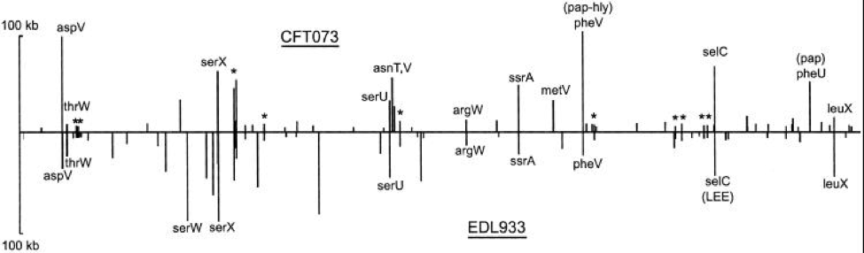

```{r setup, include=FALSE}
knitr::opts_chunk$set(echo = TRUE)
```

# Module 01


## Module 01 portfolio check

* Installation check
    + Completion status:
    + Comments:
* Portfolio repo setup
    + Completion status: 
    + Comments:
* RMarkdown Pretty html Challenge
    + Completion status:
    + Comments:
* Evidence worksheet_01
    + Completion status:
    + Comments:
* Evidence worksheet_02
    + Completion status:
    + Comments:
* Evidence worksheet_03
    + Completion status:
    + Comments:
* Problem Set_01
    + Completion status:
    + Comments:
* Problem Set_02
    + Completion status:
    + Comments:
* Writing assessment_01
    + Completion status:
    + Comments:
* Additional Readings
    + Completion status:
    + Comments  
    
## Data science Friday  


### Installation check


  

  

### Portfolio repo setup
Detail the code you used to create, initialize, and push your portfolio repo to GitHub. This will be helpful as you will need to repeat many of these steps to update your porfolio throughout the course.


`git add .`  
`git commit -m "type message"`  
`git push`  

### RMarkdown pretty html challenge
Paste your code from the in-class activity of recreating the example html.

* [R Markdown PDF Challenge] [R Markdown PDF Challenge ]
    + [Challenge Goals] [Challenge Goals]
        + [Here's a header!] [Here's a header!]  
        + [Table Time]  [Table Time]

# R Markdown PDF Challenge 

The following assignment is an exercise for the reproduction of this .html document using the RStudio and RMarkdown tools we’ve shown you in class. Hopefully by the end of this, you won’t feel at all the way this poor PhD student does. We’re here to help, and when it comes to R, the internet is a really valuable resource. This open-source program has all kinds of tutorials online.  

  
http://phdcomics.com/ Comic posted 1-17-2018  

## Challenge Goals  

The goal of this R Markdown html challenge is to give you an opportunity to play with a bunch of different RMarkdown formatting. Consider it a chance to flex your RMarkdown muscles. Your goal is to write your own RMarkdown that rebuilds this html document as close to the original as possible. So, yes, this means you get to copy my irreverant tone exactly in your own Markdowns. It’s a little window into my psyche. Enjoy =)  

__hint: go to the [PhD Comics website](www.phdcomics.com) to see if you can find the image above__  
_If you can’t find that exact image, just find a comparable image from the PhD Comics website and include it in your markdown_  

### Here's a header!  

Let’s be honest, this header is a little arbitrary. But show me that you can reproduce headers with different levels please. This is a level 3 header, for your reference (you can most easily tell this from the table of contents)

#### Another header, now with maths  

Perhaps you’re already really confused by the whole markdown thing. Maybe you’re so confused that you’ve forgotton how to add. Never fear! A ~~calculator~~ R is here:

```{r}
1231521+12341556280987
```

```{r echo=FALSE}
## [1] 1.234156e+13
```

### Table Time

Or maybe, after you’ve added those numbers, you feel like it’s about time for a table!  
I’m going to leave all the guts of the coding here so you can see how libraries (R packages) are loaded into R (more on that later). It’s not terribly pretty, but it hints at how R works and how you will use it in the future. The summary function used below is a nice data exploration function that you may use in the ^future^.

```{r}
library(knitr)
kable(summary(cars),caption="I made this table with kable in the knitr package library")
```

And now you’ve almost finished your first RMarkdown! Feeling excited? We are! In fact, we’re so excited that maybe we need a big finale eh? Here’s ours! Include a fun gif of your choice!


## Origins and Earth Systems
### Evidence worksheet 01 "Prokaryotes: the unseen majority"

[Whitman *et al* 1998](https://www.ncbi.nlm.nih.gov/pmc/articles/PMC33863/)

#### Learning objectives
Describe the numerical abundance of microbial life in relation to ecology and biogeochemistry of Earth systems. 

#### General questions
* What were the main questions being asked?  

    + The number of prokaryotes and the total amount of their cellular carbon on earth 
    + How do prokaryotes affect the global carbon cycle?  
    + Genetic diversity and number of mutations?   
    + Distribution of microbes on Earth
    + Microbial cellular production rate

* What were the primary methodological approaches used?  

    + Referenced papers and estimated numbers based on assumptions
    + Methodological approaches not explained and detail  
    + Estimates were the primary methodological approaches used but with a lot of uncertainty.  

* Summarize the main results or findings.  

    + Total amount of prokaryotic carbon is 60–100% of the estimated total carbon in plants, and inclusion of prokaryotic carbon in global models will almost double estimates of the amount of carbon stored in living organisms.  
    + Cellular production is highest.  
    + More mutations in oceans than other populations (high turnover time, more mutations). 
    + The number of prokaryotes and the total amount of their cellular carbon on earth are estimated to be 4–6 × 1030 cells and 350–550 Pg of C (1 Pg = 1015 g), respectively  
    + Most of the earth’s prokaryotes occur in the open ocean, in soil, and in oceanic and terrestrial subsurfaces, where the numbers of cells are 1.2 × 1029, 2.6 × 1029, 3.5 × 1030, and 0.25–2.5 × 1030, respectively.  
    + Estimate for the average turnover time of prokaryotes in the subsurface is on the order of 1–2 × 103 yr.  


* Do new questions arise from the results?  

    + Turnover time at subsurface?  
    + How is the bacterial population vs archaea population (distinguish between the two)?  
    + Species definition of prokaryotes vs eukaryotes  
    + Species concept exists for prokaryotes? and how is it defined?  


* Were there any specific challenges or advantages in understanding the paper (*e.g.* did the authors provide sufficient background information to understand experimental logic, were methods explained adequately, were any specific assumptions made, were conclusions justified based on the evidence, were the figures or tables useful and easy to understand)?  

    + Not enough background information, they just jump into assumptions and calculations.  
    + Tables and figures are not summarized or explained in results.
    + A lot of assuptions and uncertainties, estimates not backed up with methodological approaches.  

### Evidence Worksheet_02 “Life and the Evolution of Earth’s Atmosphere”  

[Kasting *et al* 2002](https://www.ncbi.nlm.nih.gov/pubmed/12004117)

#### Learning objectives: 
Comment on the emergence of microbial life and the evolution of Earth systems
    
    
* Indicate the key events in the evolution of Earth systems at each approximate moment in the time series. If times need to be adjusted or added to the timeline to fully account for the development of Earth systems, please do so. 

    + 4.6 billion years ago: The Earth forms and is bombarded by meteorites and comets 
    
    + 4.2 billion years ago: formation of the moon. Oldest fossils found  
    
    + 3.8 billion years ago: Replicating molecules (the precursors of DNA) form.  
    
    + 3.75 billion years ago: The Earth's crust solidifies, formation of the oldest rocks Condensation of atmospheric water into oceans
    
    + 3.5 billion years ago: Unicellular life evolves. Photosynthetic bacteria begin to release oxygen into the atmosphere  
    
    + 3.0 billion years ago: global glaciation, heavy brown gases kept earth warm and heat trapped
    
    + 2.7 billion years ago: Evolution of Paranthropus
    
    + 2.2 billion years ago: Organisms with mitochondria capable of aerobic respiration appeared  
    
    + 2.1 billion years ago: multicellular life evolves. Eukaryotes evolve.
    
    + 1.3 billion years ago: First sexually reproducing organisms. 
    
    + 550,000 years ago: Evolution of Homo heidelbergensis
    
    + 200,000 years ago: Anatomically modern humans appear in Africa


* Describe the dominant physical and chemical characteristics of Earth systems at the following waypoints:  

    + Hadean: Formation of Moon's crust. Liquid water oceans existed despite surface temperatures due to atmospheric pressure. Acceleration of dust and gases and frequent collisions of larger planetesimals and stabilization of its core and crust and development of oceans and atmosphere.  
    
    + Archean: Earth's crust had cooled enough to allow formation the formation of continents. Atmosphere nearly lacked free oxygen.  
    
    + Precambrian: Diveded into Haedean, Archaean, and Proterozoic. Movement of Earth's plates. Stromatolites fossils, three layers of sedimaentary rocks. 
    
    + Proterozoic: transition to an oxygented atmosphere, produced snowball Earth. Eukaryotes and multicellular life.
    
    + Phanerozoic: animal and plant life existed. Emergence of a number of a number of animal phyla. Techtonic forces caused continents to move and eventually collect into Pangaea.  


### Evidence worksheet_03 "The Anthropocene"

[Rockstorm *et al* 2009](https://www.ncbi.nlm.nih.gov/pubmed/19779433)

#### Learning objectives:
Evaluate human impacts on the ecology and biogeochemistry of Earth Systems
#### Specific Questions:

What were the main questions being asked?  
- What are planetery boundaries that must not be crossed to help prevent human activities from causing unacceptable environmental change?  
- What are some approaches to define preconditions for human development?  
- What are the biophysical thresholds?  
- How many planetry boundaries have been crossed?   
What were the primary methodological approaches being used?    
- Analysis of biogeochemical cycles    
- Review of previous findings  
- Comparison of earth's systems and changes througout different time periods.  
- Estimates of variables and current states  
Summarize the main results or findings.    
- Three of nine interlinked planetary boundaries have been overstepped.   
- Safe operating spaces defined   
- Biodiversity loss, climate change and human interference with the nitrogen cycle have already been exceeded.    
Do new questions arise from the results?    
- Are these boundaries overstepped due to human activities or part of normal atmospheric transformation as evident througout evolution?    
- What kind of interventions or approaches can be taken to reverse these effects and restore safe boundaries?    
Were there any specific challenges or advantages in understanding the paper (e.g. did the authors provide sufficient background information to understand experimental logic, were methods explained adequately, were any specific assumptions made, were conclusions justified based on the evidence, were the figures or tables useful and easy to understand)?  
- Limited literature review     
- Not enough background information and explanation of methodological approaches    
- Conclusions were only justified based on estimates and assumptions    
- Figures and tables were somewhat useful and easy to understand    
     

As we discussed in class today, to complete evidence worksheet 3 please select one of the following papers to report on:

1) Rockstrom, Nature_2009 .pdf,

2) Science-2016-Waters-.pdf, or

3) Canfield, Science_2010.pdf


### Problem set 01
#### Learning objectives: 
Describe the numerical abundance of microbial life in relation to the ecology and biogeochemistry of Earth systems.

#### Specific questions:
* What are the primary prokaryotic habitats on Earth and how do they vary with respect to their capacity to support life? Provide a breakdown of total cell abundance for each primary habitat from the tables provided in the text.   
    + Acquatic = 1.181e+29  
    + Soil = 2.556e+29  
    + Subsurface = 3.8e+30  

* What is the estimated prokaryotic cell abundance in the upper 200 m of the ocean and what fraction of this biomass is represented by marine cyanobacterium including Prochlorococcus? What is the significance of this ratio with respect to carbon cycling in the ocean and the atmospheric composition of the Earth?  

    + The estimated prokaryotic abundance in the upper 200 m of the ocean is 3.6e+28, 8% of this biomass is represented by marine cyanobacterium including Prochlorococuus. Since they are autotrophs, they are the major players in driving one part of the carbon cycle by assimilating inorganic carbon into organic carbon through photosynthesis.
    + 4e+4 / 5e+5 * 100 = 8%

* What is the difference between an autotroph, heterotroph, and a lithotroph based on information provided in the text?  
   + Autotroph: organisms that produce complex carbons from simple inorganic substances such as carbon dioxide. “Self nourishing”, fix inorganic carbon (CO2) and make up the biomass.   
    + Heterotroph: organism that ingests or absorbs organic carbon in order to be able to produce energy and synthesize compounds to maintain its life. Assimilate organic carbon.    
    + Lithotroph: organisms that use inorganic substrate to obtain reducing equivalents for use in biosynthesis or energy conservation via aerobic or anaerobic respiration. Use inorganic substrates.   

* Based on information provided in the text and your knowledge of geography what is the deepest habitat capable of supporting prokaryotic life? What is the primary limiting factor at this depth?  

    + At 4 km, the average temperature reaches 125 degree Celsius, which is close to the upper temperature limit for prokaryotic life. Terrestrial up to 4 km below, change in degree Celsius around 22C/km.   


* Based on information provided in the text your knowledge of geography what is the highest habitat capable of supporting prokaryotic life? What is the primary limiting factor at this height?  

    + The atmosphere is the highest habitat (57-77 km) capable of supporting prokaryotic life. Some factors that can limit survival of airborne prokaryotes are nutrient availability, moisture (desiccant conditions) and UV radiation (Budny, 2017 p. 31)  

Budny, JA. 2017. Book review: Aerobiology—The toxicology of airborne pathogens and toxins. Los Angeles, CA: SAGE. [Publications.10.1177/1091581816678191](http://journals.sagepub.com/doi/abs/10.1177/1091581816678191)

* Based on estimates of prokaryotic habitat limitation, what is the vertical distance of the Earth’s biosphere measured in km?  
    + 20km atmosphere plus 4km subsurface equals 24km   

* How was annual cellular production of prokaryotes described in Table 7 column four determined? (Provide an example of the calculation)  
    + Calculate turnover time per year (/365)*population size  
    + Population size times number of turnover per year gives number of cells per year  
    + Marine heterotrophs= 3.6e+28 cells * 365 days /16 turnvers = 8.2e+29 cells/year  

    + What drives turnover: phages to shape and modulate population. Interaction is a network. Viruses are modulators of metabolism at level of community and population, increasingly carry accessory metabolic genes, encoding genes that influence metabolic network in cells, therefore cells can be reprogrammed by viruses.  


* What is the relationship between carbon content, carbon assimilation efficiency and turnover rates in the upper 200m of the ocean? Why does this vary with depth in the ocean and between terrestrial and marine habitats?  

    + Carbon assimilation efficiency and carbon content determine turnover rates in the upper 200m of the ocean. The amount of net primary productivity required to sustain prokaryotic turnover is dependent on both C assimilation efficiency and total carbon content of the population, which then sets an upper limit on turnover rates. These vary between habitats because different assimilation efficiencies and total carbon content, as well as the amount of total net primary productivity each habitat zone consumes.  

    + Carbon efficiency assumption of these heter or photosynthetic organisms is 20%,  use 4 multiplier not 5? Why? 5 multiplier would bring to 100%.  
    + 20fg of carbon/cell
    + Average about 20 =20e+-30 pg/cell
    + Need to now number of cells and total amount of carbon per cell  

    + 3.6e+28 cells * 20e+-30 pg/cell= 0.72 pg C in marine hetero  

    + 4*0.72 =2.88pg/year (a lot to be moving through the ocean to cellular biomass)  

    + 51pg C/yr , 85% consumed =43 pgC  
    + 43 pg C/yr / 8 8 pg/yr = 14/9 turnover/yr, convert into turnover in days =1 turnover every 24.5 days   


* How were the frequency numbers for four simultaneous mutations in shared genes determined for marine heterotrophs and marine autotrophs given an average mutation rate of 4 x 10^-7^ per DNA replication? (Provide an example of the calculation with units. Hint: cell and generation cancel out)  

    + 4e+-7 mutations/generation
    (4e+-7)^4 = 2.56e+-26 mutations/generation
    3.6e+28 cells(standing population turning over 22.8 times per year)
    365/16 =22.8 turnover per year

    + 3.6e+28 *22.8 =8.2e+29 cells/year

    + 8.2 e+29 cells/year * 2.56e+-26 mutations/generation
  =2.1 *10^4 mutations/yr  convert to hours per mutation, 4 simultaneous mutations in   the same gene occurs once every 0.4 hr (stated in the paper)

    + 2.1e+4/365/24 =2/4 mutation/hr
  ½.4 mutation/hr =0.4 hr/mutation 

    + point mutation not lateral gene transfer(insertion or deletion)  


* Given the large population size and high mutation rate of prokaryotic cells, what are the implications with respect to genetic diversity and adaptive potential? Are point mutations the only way in which microbial genomes diversify and adapt?  

    + The large population size and high mutation rate of prokarypotic cells faclitates gene transfer through transformation, transduction and conjugation. The major elements of microbial evolution include genetic transfer followed by illegitimate (HGT) or homologous recombination, point mutations and genome rearrangements.

* What relationships can be inferred between prokaryotic abundance, diversity, and metabolic potential based on the information provided in the text?  

    + Prokaryote abundance creates an opportunity for frequent mutations and genetic material exchanges that allows adaptation of prokaryotes to different habitats. Adaptation to unique environments will eventually lead to divergence in metabolic potential and ultimately evolution and diversity. 
Might need to make this more specific based on the equation above.  

### Problem set_02 “Microbial Engines”

[Falkowski *et al* 2008](https://www.ncbi.nlm.nih.gov/pubmed/18497287)

#### Learning objectives: 
Discuss the role of microbial diversity and formation of coupled metabolism in driving global biogeochemical cycles.

#### Specific Questions:
* What are the primary geophysical and biogeochemical processes that create and sustain conditions for life on Earth? How do abiotic versus biotic processes vary with respect to matter and energy transformation and how are they interconnected?  

    + Geophysical = techtonics and atmospheric processes continuosly supply substrates and remove products, creating geochemical cycles. They are abiotically driven acid-base reactions (no microorganisms involved). Ex. volcanoes and rock weathering.  
    + Biogeochemical = biologically driven redox reactions that set lower limits on external energy required to sustain the cycles. 6 Major elements.
    + Resupply of C, S, and P is dependent on tectonics. Acid base reactions provide protons used in redox reactions.   

* Why is Earth’s redox state considered an emergent property?  
  
    + Emergent properties come from a collection of things and not a single entity. Redox reactions arise from microbial life and driven by photosynthesis. Genes form the basis of the pathways. Large entities driven through interactions among smaller or simpler entities such that the larger entities exhibit properties the smaller ones do not exhibit.  

* How do reversible electron transfer reactions give rise to element and nutrient cycles at different ecological scales? What strategies do microbes use to overcome thermodynamic barriers to reversible electron flow?  

    + reversible metabolic pathways in biogeochemical cycles are not directly related, and sometimes catalyzed by diverse, multispecies microbial interactions. For example, redox reactions driving the Earth's nitrogen cycle. Nitrogen fixation makes N2 accessible for the synthesis of proteins and nucleic acids. This biologically irreversible reaction is catalyzed by an extremely conserved heterodimeric enzyme complex, nitrogenase.  

* Using information provided in the text, describe how the nitrogen cycle partitions between different redox “niches” and microbial groups. Is there a relationship between the nitrogen cycle and climate change?   

    + increase in carbon dioxide and organic matter  
    + reduction and oxidation reactions segregated in different organisms.  

* What is the relationship between microbial diversity and metabolic diversity and how does this relate to the discovery of new protein families from microbial community genomes?  
    + Cycles have co-evolved and influence outcomes of each other.
    + Metabolic pathways evolved to utilize available substrates produced as end products of other types of microbial metabolism. Ex. photosynthesis result of evolution of multiple metabolic pathways that lead to a cycle.

* On what basis do the authors consider microbes the guardians of metabolism?  
    + Horizontal gene transfer is responsible for conserving the genes neccesary for encoding the ezymes involved in the complex reactions necessary for metabolism.

### Writing assessment_01  

"Microbial life can easily live without us; we, however, cannot survive without the global catalysis and environmental transformations it provides".   

  Microorganisms play a critical role in sustaining life on Earth (1). There’s a growing interest in understanding the interdependence of humans and their microbial counterparts, especially with current climate change issues and role of humans in disrupting balances of biogeochemical cycles (2). There’s no question of the microbial importance in developing the current atmospheric conditions that enable us and other organisms to live and thrive on Earth, but are we able to sustain life without their aid for centuries to come? I argue that human life would not be able to persist in the absence of microbes to the same quality and quantity of life that we know of today. My argument will consider the dominance of microbes on Earth, the metabolic diversity of microbes which they have evolved over the years, and their potential as biological solution to reverse centuries of environmental damage and evolve to a more sustainable state of living. Human life will cease to exist without the fundamental roles of microbes that contribute to both human and environmental function.  

Dominance of microbes on Earth: abundance and diversity   

  Earth is dominated by microbes who engineered the planet over geological time that enabled humans to exist today. Microbes have been around for nearly 3.5 billion years, long before modern humans emerged about 200,000 years ago (3, 4). They are amongst the oldest life forms and have evolved into diverse communities utilizing metabolic pathways to obtain energy and use different surrounding materials. Only a small fraction of these microbes grow in the laboratory and do not represent the total diversity that exists in nature. This is due to the inability to recreate the natural environment they grow in to the laboratory setting. We know of their existence and diversity through metagenomics sequencing and molecular techniques independent of our ability to culture these organisms (4). Most of the earth’s prokaryotes (domains Archaea and Bacteria) occur in the open ocean, in soil, and in oceanic and terrestrial subsurfaces, where the numbers of cells are $1.2^{29}$, $2.6^{29}$, $3.5^{30}$, and $0.25–2.5^{30}$, respectively (5). At all levels of bacterial phylogeny, uncultured clades that do not grow on standard media are playing critical roles in cycling carbon, nitrogen, and other elements, while impacting the surrounding organisms and environment. As an example of their essential roles that enabled our existence, they were responsible for the Earth’s Great Oxygenation Event (6). This event took place nearly 2.4 billion years ago and was primarily caused by cyanobacteria, which eventually led to the emergence of plants, animals, and humans (6). Molecular oxygen was formed as a byproduct of photosynthesis by the oxygenic prokaryotes, changing the environment for single-celled eukaryotes that tolerate oxygen to thrive while anaerobic inhabitants became extinct (7). The great oxygenation event was the point when dissolved iron became insoluble and unable to capture oxygen, therefore enabling its accumulation in the atmosphere (7). Free oxygen has been an important part of the atmosphere ever since. Due to the accumulation of free oxygen, methane was removed to produce carbon dioxide. Methane is a far more efficient greenhouse gas than carbon dioxide, and this methane was keeping the planet warm (7). As levels dropped, the Earth cooled, causing the Huronian glaciation which was possibly the longest Snowball Earth period (7). Thus, microbes have engineered the planet over geological time and have been able to persist throughout those atmospheric changes and harsh conditions. In that process, they have engineered conditions that enabled higher eukaryotic and multicellular organisms including humans to exist today. If Earth is subjected to another global atmospheric change, microbes will be of great help to ensure the survival of humans through their metabolic capabilities and abundance on Earth.  
 
Microbial communities and their metabolic activities are highly diverse  

  The prokaryotic world presents us with a far larger variety of metabolic types than are found among the eukaryotes (fungi, higher plants, protozoa and animals). Microorganisms are the main agents responsible for biogeochemical transformations of carbon, nitrogen, sulfur, iron, and other elements (1). They provide many essential services to Earth through their impact on ecosystems. They generate oxygen in the atmosphere, recycle nutrients stored in organic matter to an inorganic form and give plant roots access to nutrients in the soil (8). They are extremely powerful on a global scale in that they provide 50% of the total oxygen produced over history, 75% of the nitrogen additions to the atmosphere, 70% of methane production and 50% of carbon dioxide produced back to the atmosphere (6). Therefore, they serve as key links in nutritional demands and waste management on Earth. Without these microbial roles, nutritional and waste managements would be greatly affected and a wide range of living species would undergo major disruptions as a result. The range of substrates used by prokaryotes as carbon sources for growth (assimilatory metabolism) is far greater than in the eukaryotic world. In addition, many groups of prokaryotes perform types of energy generation (dissimilatory reactions) that are altogether unknown among the eukaryotes. Processes such as oxygenic and anoxygenic photosynthesis, aerobic and anaerobic respiration, and chemolithotrophic metabolism together enable the functioning of the biogeochemical cycles of the elements on Earth (7). This is evident in the substantial contribution of diazotrophic cyanobacteria Trichodesmium spp. to the nitrogen influx in marine ecosystems (9). Diazotrophs are microorganisms that are able to grow without external sources of fixed nitrogen (10). Trichodesmium spp. are able to fix nitrogen despite having their N2-reducing enzyme, nitrogenase, rapidly inactivated by O2 (9). They evolved complex mechanisms such as temporal regulation, where they fix nitrogen in the morning and photosynthesize in the afternoon, to protect their enzyme (9, 11). Other cyanobacteria such as the filamentous Anabaena spp. fix nitrogen in their specialized cells known as heterocysts (11). Therefore, the ability of Trichodesmium spp. and Anabaena spp. to optimize their diazotrophic capacity demonstrates that microorganisms are highly evolved biological systems, able to carry out diverse metabolic activities.  

Biological solution: Harnessing the power of microbial metabolism  

  Now that we understand that microbes are a dominant force on Earth, we can harness their hidden powers and use them as an inspiration to build biological systems that will allow us to live more sustainably. Waste degradation by microorganisms is of tremendous importance. Aside from natural waste produced by living organisms, human activities for global development purposes throughout the past decades have resulted in release of enormous amounts of industrial, biomedical, hazardous, nuclear and inert wastes (2). Microbes facilitate the chemical process of breaking down organic matter by converting the waste into carbon dioxide, water, energy, water soluble minerals and ammonium (9). The ammonium will be further converted by bacteria through nitrification into nitrites and nitrates, which will be usable by plants (9). Several waste management purposes are fulfilled by this process. Each year, several million tons of oil are discharged into the oceans every year originating from human activity (12). Microbes alone facilitate the process that breaks down the oil in deep water. They do this by breaking down the ring structures of the hydrocarbons in the oil by using their diverse enzymes and oxygen in the seawater. These oil consuming bacteria are naturally occurring in oceans around the world (12). Hydrocarbon-consuming microbes, such as Alcanivorax borkumensis, are vital in cleaning oil spills as they become the dominant microbes in oil-polluted waters (12). Its genome is equipped with genes accounting for its wide hydrocarbon substrate range and efficient oil-degrading capabilities. The sequence of its genome will provide the basis for future design of strategies that might mitigate the damages caused by oil spills. Other pollutant eating bacteria such as plastic or heavy metal eating bacteria have been exploited by humans to improve or accelerate the biodegradation of pollutants (13, 14)  Thus, biological solutions may be the best option to reverse climate change through their natural capabilities to manage and recycle waste materials. This can be done by exploiting natural occurring microbes or engineering microbes specific for bioremediation purposes. For example, reclamation of crude oil-contaminated soil by microorganisms is a well-documented process (14). Indigenous microorganisms utilize the total petroleum hydrocarbons (TPH) of crude oil as a source of carbon and energy and break them down to simpler non-toxic compounds. Recombinant strain of Acenitobacter baumanii was found to enhance degradation rates at sites contaminated with crude oil (15). Soil microcosms were designed to study the degradation efficacy for TPH of crude oil by lux-tagged A. baumannii S30 pJES. Bioaugmentation of a TPH-contaminated microcosm with A. baumannii S30 pJES showed that TPH levels were reduced from 89.3 to 53.9 g/kg soil in 90 days (14). The bioaugmentation of microbes with high efficiency for such degradation is thus a proven technique for efficient bioremediation. Genetically modified organisms with increased capacity to degrade and tolerate toxic compounds present in crude oil is an effective measure to reduce oil pollution and alleviate their environmental impact.  

Conclusion  

  Microorganisms do not live in isolation in nature, but coexist in highly interactive communities known as consortia (16). They establish relationships that will have an effect on all interacting species and thus it is apparent that they function more as a coherent group that is able to occupy multiple ecological niches (16). Studying microbial consortia will aid in environmental protection or biodegradation and will offer a solution to reversing human activities which have overstepped several planetary boundaries (16). However, knowing some of the beneficial effects of microorganisms will not be sufficient to elucidate their function on a global scale. Stability of human life is highly dependent on the biogeochemical cycles which are determined by microbial processes. Human-induced environmental changes may soon cause a sixth major extinction and so understanding microbial ecosystems will help predict the likelihood of major disasters (17).  

  In conclusion, I argue that humans will not be able to sustain life on this planet without the global catalysis and environmental transformations that microbes provide. Quality of life on this planet would become increasingly worse to humans, although microbial life would endure. My argument outlined the major role microbes play in atmospheric evolution, their metabolic diversity and their potential as a biological solution to human-induced environmental damage. Future work should be aimed at further elucidating complex microbial communities in ecosystems and climate change interactions. Harnessing the power of microbes by using their genetic information to engineer novel microbial strains for more efficient biotechnological process will change the way we consume natural materials and reverse centuries of environmental damage that we have caused.  

###Writing assignment 1 References: 

1. Falkowski, PG, Fenchel, T, Delong, EF. 2008. The Microbial Engines That Drive Earth's Biogeochemical Cycles. Science. 320:1034-1039. [link](https://www.ncbi.nlm.nih.gov/pubmed/18497287)  
2. Gilbert, JA, Neufeld, JD. 2014. Life in a World without Microbes. PLoS Biology. 12:e1002020. [link](http://journals.plos.org/plosbiology/article?id=10.1371/journal.pbio.1002020)  
3. Reed, FA. 2012. Modern Human Migrations: The First 200,000 Years. In Anonymous , 2012th ed: 315-326. [link](https://link-springer-com.ezproxy.library.ubc.ca/chapter/10.1007%2F978-3-7091-0950-2_29)  
4. Ingraham, JL. 2017. Kin: how we came to know our microbe relatives. Harvard University Press, Cambridge, Massachusetts.  [link](http://webcat1.library.ubc.ca/vwebv/holdingsInfo?bibId=8967297)  
5. Whitman, WB, Coleman, DC, Wiebe, WJ. 1998. Prokaryotes: The Unseen Majority. Proc. Natl. Acad. Sci. U. S. A. 95:6578-6583. doi: 10.1073/pnas.95.12.6578.  [link](http://www.pnas.org/content/95/12/6578)  
6. Kasting, JF, Siefert, JL. 2002. Life and the Evolution of Earth's Atmosphere. Science. 296:1066-1068. [link](http://science.sciencemag.org/content/296/5570/1066)  
7. Schirrmeister, BE, Jurriaan M. de Vos, Antonelli, A, Bagheri, HC, Naturvetenskapliga fakulteten. 2013. Evolution of multicellularity coincided with increased diversification of cyanobacteria and the Great Oxidation Event. Proc. Natl. Acad. Sci. U. S. A. 110:1791-1796. [link](http://www.pnas.org/content/110/5/1791)   
8. Lau, JA, Lennon, JT, Heath, KD. 2017. Trees harness the power of microbes to survive climate change. Proceedings of the National Academy of Sciences of the United States. 114: 12. [link](http://www.pnas.org/content/114/42/11009)  
9. Canfield, DE, Glazer, AN, Falkowski, PG. 2010. The Evolution and Future of Earth's Nitrogen Cycle. Science. 330:192-196. [link](https://www.ncbi.nlm.nih.gov/pubmed/20929768)  
10. Sen, S, Agrawal, C, Mishra, Y, Rai, S, Chatterjee, A, Yadav, S, Singh, S, Rai, LC. 2015. Exploring the membrane proteome of the diazotropic cyanobacterium Anabaena PCC7120 through gel-based proteomics and in silico approaches. Journal of Proteomics. 127:161-168. [link]    
11. Herrero, A, Muro-Pastor, AM, Flores, E. 2001. Nitrogen control in cyanobacteria. J. Bacteriol. 183:411-425. [link](https://www.ncbi.nlm.nih.gov/pubmed/26210591)  
12. Gertler, C, Pühler, A, Denaro, R, Ferrer, M, Regenhardt, D, Yakimov, MM, Brecht, M, Bekel, T, Rupp, O, Weidner, S, Buhrmester, J, Kaminski, F, Timmis, KN, Meyer, F, Bartels, D, Golyshin, PN, Vorhölter, F, Kaiser, O, dos Santos, Vítor AP Martins, McHardy, AC, Nechitaylo, T, Khachane, AN, Schneiker, S, Chernikova, TN, Goesmann, A, Linke, B, Selbitschka, W, Lang, S, Sabirova, JS, Golyshina, OV. 2006. Genome sequence of the ubiquitous hydrocarbon-degrading marine bacterium Alcanivorax borkumensis. Nat. Biotechnol. 24:997-1004. [link](https://www.ncbi.nlm.nih.gov/pubmed/16878126)  
13. Yang, J, Yang, Y, Wu, W, Zhao, J, Jiang, L. 2014. Evidence of polyethylene biodegradation by bacterial strains from the guts of plastic-eating waxworms. Environ. Sci. Technol. 48:13776. [link](https://pubs.acs.org/doi/abs/10.1021/es504038a)     
14. Mishra, S, Jyot, J, Kuhad, RC, Lal, B. 2001. Evaluation of Inoculum Addition To Stimulate In Situ Bioremediation of Oily-Sludge-Contaminated Soil. Appl. Environ. Microbiol. 67:1675-1681. [link](http://aem.asm.org/content/67/4/1675)  
15. Mishra, S, Sarma, PM, Lal, B. 2004. Crude oil degradation efficiency of a recombinant Acinetobacter baumannii strain and its survival in crude oil-contaminated soil microcosm. FEMS Microbiol. Lett. 235:323-331. [link](https://www.ncbi.nlm.nih.gov/pubmed/15183881)  
16. Thibaud, T, Anna, P, Yigal, M, S, WN. 2017. Microbial consortia at steady supply. eLife. 6. [link](https://elifesciences.org/articles/22644)  
17. Rockström, J, Steffen, W, Noone, K, Scheffer, M, Teknik, et al. 2009. A safe operating space for humanity. Nature. 461:472-475. [link](https://www.nature.com/articles/461472a)   

### Module 01 references

+ Whitman WB, Coleman DC, and Wiebe WJ. 1998. Prokaryotes: The unseen majority. Proc Natl Acad Sci USA. 95(12):6578–6583.  [PMC33863](https://www.ncbi.nlm.nih.gov/pmc/articles/PMC33863/)  

+ Achenbach J. 2012. Spaceship Earth: a new view of environmentalism. Health and Science, The washington Post. [1d57f60801e2](https://www.washingtonpost.com/national/health-science/spaceship-earth-a-new-view-of-environmentalism/2011/12/29/gIQAZhH6WP_story.html?utm_term=.1d57f60801e2)

+ Canfield DE. 2010. The evolution and future of Earth's nitrogen cycle.Science. 330(6001):192-6. [PM20929768](https://www.ncbi.nlm.nih.gov/pubmed/20929768)

+ Falkowski PG, Fenchel T, Delong EF. 2008. The microbial engines that drive Earth's biogeochemical cycles. Science. 320(5879):1034-9. [PM18497287](https://www.ncbi.nlm.nih.gov/pubmed/18497287)  

+ James F. Kasting, Janet L. Siefert. 2002. Life and the Evolution of Earth's Atmosphere. Science. 296(5570)1066-1068. [1071184](http://science.sciencemag.org/content/296/5570/1066)  

+ The Land Ethic by Aldo Leopold. 1949. [essay](http://rintintin.colorado.edu/~vancecd/phil3140/Leopold.pdf)  

+ E. G. Nisbet & N. H. Sleep. 2001. The habitat and nature of early life. Nature 409: 1083–1091. [35059210](https://www.nature.com/articles/35059210)  

+ Falkowski P, Scholes RJ, Boyle E, Canadell J, Canfield D, Elser J, Gruber N, Hibbard K, Högberg P, Linder S, Mackenzie FT, Moore B 3rd, Pedersen T, Rosenthal Y, Seitzinger S, Smetacek V, Steffen W. 2000. The global carbon cycle: a test of our knowledge of earth as a system. Science. 290(5490):291-6. [PM11030643](https://www.ncbi.nlm.nih.gov/pubmed/11030643)

+ Rockström J, Steffen W, Noone K, Persson A, Chapin FS 3rd, Lambin EF, Lenton TM, Scheffer M, Folke C, Schellnhuber HJ, Nykvist B, de Wit CA, Hughes T, van der Leeuw S, Rodhe H, Sörlin S, Snyder PK, Costanza R, Svedin U, Falkenmark M, Karlberg L, Corell RW, Fabry VJ, Hansen J, Walker B, Liverman D, Richardson K, Crutzen P, Foley JA. 2009.
A safe operating space for humanity. Nature. 461(7263):472-5. [PM19779433](https://www.ncbi.nlm.nih.gov/pubmed/19779433)

+ Schrag DP. 2012. Geobiology of the Anthropocene. In: Knoll A, Canfield D, Konhauser K Fundamentals of Geobiology. 425-436. [9781118280874](https://onlinelibrary.wiley.com/doi/10.1002/9781118280874.ch22)  

+ Waters CN, et. al. 2016. The Anthropocene is functionally and stratigraphically distinct from the Holocene. Science. 351(6269):aad2622. [PM26744408](https://www.ncbi.nlm.nih.gov/pubmed/26744408)  

+ Zehnder, J. 1988. Biology of anaerobic microorganisms. John Wiley and Sons, Inc., New York. 872: 89-95. 
[ISBN13:9780471882268](https://aslopubs.onlinelibrary.wiley.com/doi/pdf/10.4319/lo.1989.34.3.0647)


# Module 02  

## Module 02 Portfolio Content

* Evidence worksheet_04
    + Completion status:
    + Comments:
* Problem Set_03
    + Completion status:
    + Comments:
* Writing assessment_02
    + CANCELED
* Additional Readings
    + Completion status:
    + Comments 

## Data science Friday  

## Remapping the body of the world

### Evidence worksheet_04

[Martines * et al * 2007](https://www.ncbi.nlm.nih.gov/pmc/articles/PMC1838496/)
#### Learning objectives:
*Discuss the relationship between microbial community structure and metabolic diversity    
*Evaluate common methods for studying the diversity of microbial communities  
*Recognize basic design elements in metagenomic workflows  

### Specific questions:

What were the main questions being asked?  
    + what are the genetics and biochemistry of PR photosystems?  
    + genetic tool kit: vector, multicloning site   
    + Bacterial artificial chromosome: a 130 kb clone from SAR86 contains a proteorhodopsin gene  

What were the primary methodological approaches being used? 
    + In vivo functional screening of a marine picoplankton large-insert genomic   library for recombinant clones expressing PR photosystems    
    + Exploited transient increases in vector copy number   
Summarize the main results or findings.    
    + Recombinantion Escherichia coli cells    
    + F plasmid single copy origin of replication and ori5 (inducible multiple copy- destabilizes cell, introduce homologous recombination)    
    + Took DNA from environment, programmed heterologous E. coli,recovered genes responsible for functional phenotype.    
    + looked for gene expression for phenotype interested in and determined number of genes necessary.    
    + build library in inducible system  
    + Fosmid: use phage packaging, trasduce into E .coli, get higher titers   

Do new questions arise from the results?    
    + genes evolved to localize, spectral tuning?   

Were there any specific challenges or advantages in understanding the paper (e.g. did the authors provide sufficient background information to understand experimental logic, were methods explained adequately, were any specific assumptions made, were conclusions justified based on the evidence, were the figures or tables useful and easy to understand)?  
    + Introduction was not adequate, coulld have elaborated further  
    + What is the global distribution of the PRs and are they conserved in different kingdoms and phyla?  
    + Methods not discussed in detail   
    + What about other host systems other than E. coli, will they behave the same?  
    + Are there other environemental samples that could be collected for gene expression analysis of the bacteriorhodopsin gene?  


1) Martinez et al., PNAS 2007.pdf

This classic paper describes functional metagenomic screening using E. coil as a heterologous host system for environmental gene expression targeting the bacteriorhodopsin gene. 
 


### Problem set_03 “Metagenomics: Genomic Analysis of Microbial Communities”  
#### Learning objectives:   
Specific emphasis should be placed on the process used to find the answer. Be as comprehensive as possible e.g. provide URLs for web sources, literature citations, etc.  
*(Reminders for how to format links, etc in RMarkdown are in the RMarkdown Cheat Sheets)*

#### Specific Questions:
* How many prokaryotic phyla and candidate divisions have been described and how many have no cultured representatives (microbial dark matter)?  
    + At least 89 bacterial and 20 archaeal phyla are recognized by small ribosomal RNA databases [Solden *et al* 2016](https://www.ncbi.nlm.nih.gov/pubmed/27196505).   
    + True phyla count is higher and could range up to 1,500 bacterial phyla.  
    + As there are prokaryotes that live in the "shadow biosphere" [Youssef *et al* 2015](https://www.ncbi.nlm.nih.gov/pubmed/26257925).   
    + Only 26 of the approximately 52 identifiable major phyla within the domain bacteria have culturable representatives [Rappe *et al* 2003](https://www.ncbi.nlm.nih.gov/pubmed/14527284).  
    + Only information about that life comes from sequencing and so this number is increasing.   

* How many metagenome sequencing projects are currently available in the public domain and what types of environments are they sourced from?  
  Shotgun Metagenomics (IMG/m, MG-RAGT, NCIB)  
    + Assembly - EULER  
    + Binning- SGCOM  
    + Annotation-KEGG  
    + Analysis pipelines-Megan 5  
  Marker Gene Metagenomics  
    + Standalone software-OTUbase    
    + Analysis pipelines - SILVA  
    + Denoising - Amplicon Noise  
    + Databases Ribosomal database project (RDP)  

[Thomas *et al* 2012](https://www.ncbi.nlm.nih.gov/pmc/articles/PMC3351745/)  

  Environments: all (sediments, soil, gut, acquatic, etc)   
    + especially those hard to culture communities in last setting.    

* What types of on-line resources are available for warehousing and/or analyzing environmental sequence information (provide names, URLS and applications)?  
    + MEGAN, the MEtaGenome ANalyzer program. Analyzes the taxonomic and functional content   
    
[Oulas *et al* 2015](http://journals.sagepub.com/doi/pdf/10.4137/BBI.S12462)    
    
[Huson *et al* 2012](https://www.ncbi.nlm.nih.gov/pubmed/22399469)    

[Science 2009](https://books.google.ca/books?id=rLhdW5YzuO4C&pg=RA5-PA225&lpg=RA5-PA225&dq=warehousing+and/or+analyzing+environmental+sequence+information&source=bl&ots=p-e7vp8hMM&sig=-YZG0tNtilCyVY3LVRZQY01U3yk&hl=en&sa=X&ved=0ahUKEwi6kM-r8IHaAhUFHGMKHYDDBx8Q6AEIPzAC#v=onepage&q=warehousing%20and%2For%20analyzing%20environmental%20sequence%20information&f=false)

* What is the difference between phylogenetic and functional gene anchors and how can they be used in metagenome analysis?    
  + Functional screens (biochemical)  
    + Third generation sequencing (nanopore)   
    + single cell sequencing   
    + FISH probe   
  + Phylogenetic  
    + Vertical gene transfer    
    + carry phylogenetic information allowing tree reconstruction    
    + Tazonomic   
    + Ideally single copy   


* What is metagenomic sequence binning? What types of algorithmic approaches are used to produce sequence bins? What are some risks and opportunities associated with using sequence bins for metabolic reconstruction of uncultivated microorganisms?  
    + Is the process of grouping of sequences or sequence reads that come from a single genome.   
    + Types of algorithms:  
        + Align sequences to database    
        + Group to each other based on DNA characteristics: GC content, codon usage   
    + Risks and opportunities in binning:   
        + Incomplete coverage of genome sequence   
        + Contamination from different phyogeny (less than 5% ideally)   
        
[Lu *et al* 2017](https://academic.oup.com/bioinformatics/article/33/6/791/2525584)

* Is there an alternative to metagenomic shotgun sequencing that can be used to access the metabolic potential of uncultivated microorganisms? What are some risks and opportunities associated with this alternative?   
    + Functional screens (biochemical etc.)   
    + third generation sequencing (nanopore)   
    + single cell sequencing   
    + FISH probe   
    
[Sharpton *et al* 2014](https://www.ncbi.nlm.nih.gov/pmc/articles/PMC4059276/)
    
 
### Module 02 references 
+ Martinez, A. S. Bradley,† J. R. Waldbauer, R. E. Summons, E. F. DeLong. 2007. Proteorhodopsin photosystem gene expression enables photophosphorylation in a heterologous host. Proc Natl Acad Sci U S A. 104(13): 5590–5595. [Martines * et al * 2007](https://www.ncbi.nlm.nih.gov/pmc/articles/PMC1838496/)   

+ Thomas J. Sharpton. 2014. An introduction to the analysis of shotgun metagenomic data. Front Plant Sci. 5: 209. [Sharpton *et al* 2014](https://www.ncbi.nlm.nih.gov/pmc/articles/PMC4059276/)  

+ Yang Young Lu  Ting Chen  Jed A. Fuhrman  Fengzhu Sun. 2017. COCACOLA: binning metagenomic contigs using sequence COmposition, read CoverAge, CO-alignment and paired-end read LinkAge. Bioinformatics. 33(6) 791–798. [Lu *et al* 2017](https://academic.oup.com/bioinformatics/article/33/6/791/2525584)  

+ Anastasis Oulas, Christina Pavloudi, Paraskevi Polymenakou, Georgios A. Pavlopoulos,
Nikolas Papanikolaou, Georgios Kotoulas, Christos Arvanitidis and Ioannis Iliopoulos. 2015. Metagenomics: Tools and Insights for Analyzing
Next-Generation Sequencing Data Derived from
Biodiversity Studies. Bioinformatics and Biology Insights. 9 75–88 [Oulas *et al* 2015](http://journals.sagepub.com/doi/pdf/10.4137/BBI.S12462)      
    
+ Huson DH, Mitra S. 2012. Introduction to the analysis of environmental sequences: metagenomics with MEGAN. Methods Mol Biol. 856:415-29. [Huson *et al* 2012](https://www.ncbi.nlm.nih.gov/pubmed/22399469)     
 
+ Torsten Thomas, Jack Gilbert, Folker Meyer. 2012. Metagenomics - a guide from sampling to data analysis. Microb Inform Exp. 2: 3. [Thomas *et al* 2012](https://www.ncbi.nlm.nih.gov/pmc/articles/PMC3351745/)   
 
+ Solden L, Lloyd K, Wrighton K. 2016. The bright side of microbial dark matter: lessons learned from the uncultivated majority. Curr Opin Microbiol. 31:217-226. [Solden *et al* 2016](https://www.ncbi.nlm.nih.gov/pubmed/27196505).    

+ Youssef NH, Couger MB, McCully AL, Criado AE, Elshahed MS. 2015. Assessing the global phylum level diversity within the bacterial domain: A review. J Adv Res. 6(3):269-82.
[Youssef *et al* 2015](https://www.ncbi.nlm.nih.gov/pubmed/26257925).    

+ Rappé MS, Giovannoni SJ. 2003. The uncultured microbial majority. Annu Rev Microbiol. 57:369-94. [Rappe *et al* 2003](https://www.ncbi.nlm.nih.gov/pubmed/14527284).  
 
# Module 03 "Microbial Species Concept"

## Module 03 Portfolio Content

* Evidence worksheet_05
    + Completion status:
    + Comments:
* Problem set_04
    + Completion status:
    + Comments:
* Writing Assessment_03
    + Completion status:
    + Comments:
* Additional Readings
    + Completion status:
    + Comments 
    

## Data science Friday  
## Problem set_04 “Fine-scale phylogenetic architecture”
#### Learning objectives: 

* Gain experience estimating diversity within a hypothetical microbial community


#### Outline:

In class Day 1:

1. Define and describe species within your group's "microbial" community.  
+ Those that share the same shape and made from same ingredients.  
  + RIGOA: Maroon, yellow, translucent, orange and brown.  
  + Skittles: Brown, yellow, red, orange and green.  
  + M&Ms: Brown, red, green, blue, orange, yellow. 
  + Mike &Ike's: yellow, pink, red, green, orange.  
  + Gummy bears: pink, red, green, orange, yellow, translucent yellow.  
  + Lego: Blue square, blue rectangle, green rectangle, yellow square, yellow rectangle, pink square, pink rectangle. 
  + Gundrops: Brownigh purple, red, green, orange, yellow.  
  + Fruit shaped gummies: gold
  + Macrophages  
  + Coke bottles  
  + Blue white drop
  + red white drop  
  + Whatermelon  
  + red green fish  
  + Kisses  
  + red snakes  
   

2. Count and record individuals within your defined species groups.
3. Remix all species together to reform the original community.
4. Each person in your group takes a random sample of the community (*i.e.* devide up the candy).

Assignment:

5. Individually, complete a collection curve for your sample.
6. Calculate alpha-diversity based on your original total community and your individual sample.

In class Day 2:

7. Compare diversity between groups.

#### Part 1: Description and enumeration
Obtain a collection of "microbial" cells from "seawater". The cells were concentrated from different depth intervals by a marine microbiologist travelling along the Line-P transect in the northeast subarctic Pacific Ocean off the coast of Vancouver Island British Columbia. 

Sort out and identify different microbial "species" based on shared properties or traits. Record your data in this Rmarkdown using the example data as a guide.

Once you have defined your binning criteria, separate the cells using the sampling bags provided. These operational taxonomic units (OTUs) will be considered separate "species". This problem set is based on content available at [What is Biodiversity](http://cnx.org/content/m12179/latest/).

For example, load in the packages you will use.
```{r message=FALSE}
#To make tables
library(kableExtra)
library(knitr)
#To manipulate and plot data
library(tidyverse)
```


Then load in the data. You should use a similar format to record your community data.
```{r}
data = data.frame(
  number = c(1,2,3,4,5, 6, 7, 8, 9, 10, 11, 12, 13),
  name = c("Rigoa", "Skittles", "M&Ms", "M&I", "Gummy bears", "Lego", "Gumdrop", "Macrophages", "coke bottles", "watermelon", "fish", "snakes", "kisses"),
  characteristics = c("5 colors", "5colors", "6 colors", "five colors", "6colors", "7 colors", "5c", "octupus shaped", "bottles" ,"fruit", "red-green" ,"red", "chocolate"),
  occurences = c(7, 197, 281, 199, 91, 18, 24, 6, 3, 1, 1, 13, 16)
)

```
cand = read.table(file="./candy_individual_count.csv", header=TRUE, row.names=1, sep=",")
                      


Finally, use these data to create a table.
```{r}
data %>% 
  kable("html") %>%
  kable_styling(bootstrap_options = "striped", font_size = 10, full_width = F)

```
	
For your community:

* Construct a table listing each species, its distinguishing characteristics, the name you have given it, and the number of occurrences of the species in the collection.
* Ask yourself if your collection of microbial cells from seawater represents the actual diversity of microorganisms inhabiting waters along the Line-P transect. Were the majority of different species sampled or were many missed?   

    + The majority of different species were sampled, although was missing individuals with different characteristics from each "species" as previously defined   
 
#### Part 2: Collector's curve
To help answer the questions raised in Part 1, you will conduct a simple but informative analysis that is a standard practice in biodiversity surveys. This analysis involves constructing a collector's curve that plots the cumulative number of species observed along the y-axis and the cumulative number of individuals classified along the x-axis. This curve is an increasing function with a slope that will decrease as more individuals are classified and as fewer species remain to be identified. If sampling stops while the curve is still rapidly increasing then this indicates that sampling is incomplete and many species remain undetected. Alternatively, if the slope of the curve reaches zero (flattens out), sampling is likely more than adequate.

To construct the curve for your samples, choose a cell within the collection at random. This will be your first data point, such that X = 1 and Y = 1. Next, move consistently in any direction to a new cell and record whether it is different from the first. In this step X = 2, but Y may remain 1 or change to 2 if the individual represents a new species. Repeat this process until you have proceeded through all cells in your collection.

For example, we load in these data.
```{r}
data2 = data.frame(
  x = c(1,2,3,4,5,6,7,8,9,10,11,12,13,14,15,16,17,18,19,20,21,22,23,24,25,26,27,28,29,30,31,32,33,34,35,36,37,38,39,40,41,42),
  y = c(1,1,1,1,1,1,1,1,1,1,1,1,1,1,2,2,3,2,2,1,2,3,1,2,1,1,3,4,3,1,1,1,1,1,5,1,1,2,4,2,1,6)
)
```

And then create a plot. We will use a scatterplot (geom_point) to plot the raw data and then add a smoother to see the overall trend of the data.
```{r}
ggplot(data2, aes(x=x, y=y)) +
  geom_point() +
  geom_smooth() +
  labs(x="Cumulative number of individuals classified", y="Cumulative number of species observed")
```

For your sample:

* Create a collector's curve for your sample (not the entire original community).
* Does the curve flatten out? If so, after how many individual cells have been collected?  
    + No, it keeps increasing     
* What can you conclude from the shape of your collector's curve as to your depth of sampling?  
    + Depth of the sampling is not adequate    

#### Part 3: Diversity estimates (alpha diversity)
Using the table from Part 1, calculate species diversity using the following indices or metrics.

##### Diversity: Simpson Reciprocal Index

$\frac{1}{D}$ where $D = \sum p_i^2$

$p_i$ = the fractional abundance of the $i^{th}$ species

For example, using the example data 1 with 3 species with 2, 4, and 1 individuals each, D =

```{r}
species1 = 4/(4+4+6+29+35+51+35+1+2+0+0+3+7)
species2 = 4/(4+4+6+29+35+51+35+1+2+0+0+3+7)
species3 = 6/(4+4+6+29+35+51+35+1+2+0+0+3+7)
species4 = 29/(4+4+6+29+35+51+35+1+2+0+0+3+7)
species5 = 35/(4+4+6+29+35+51+35+1+2+0+0+3+7)
species6 = 51/(4+4+6+29+35+51+35+1+2+0+0+3+7)
species7 = 35/(4+4+6+29+35+51+35+1+2+0+0+3+7)
species8 = 1/(4+4+6+29+35+51+35+1+2+0+0+3+7)
species9 = 2/(4+4+6+29+35+51+35+1+2+0+0+3+7)
species10 = 0/(4+4+6+29+35+51+35+1+2+0+0+3+7)
species11 = 0/(4+4+6+29+35+51+35+1+2+0+0+3+7)
species12 = 3/(4+4+6+29+35+51+35+1+2+0+0+3+7)
species13 = 7/(4+4+6+29+35+51+35+1+2+0+0+3+7)


1 / (species1^2 + species2^2 + species3^2+ species4^2+ species5^2+species6^2+species7^2+species8^2+species9^2+species10^2+species11^2+species12^2+species13^2)
```

The higher the value is, the greater the diversity. The maximum value is the number of species in the sample, which occurs when all species contain an equal number of individuals. Because the index reflects the number of species present (richness) and the relative proportions of each species with a community (evenness), this metric is a diveristy metric. Consider that a community can have the same number of species (equal richness) but manifest a skewed distribution in the proportion of each species (unequal evenness), which would result in different diveristy values.

* What is the Simpson Reciprocal Index for your sample? 
    + 5.201561   
* What is the Simpson Reciprocal Index for your original total community?
    + 4.706271  
    
##### Richness: Chao1 richness estimator
Another way to calculate diversity is to estimate the number of species that are present in a sample based on the empirical data to give an upper boundary of the richness of a sample. Here, we use the Chao1 richness estimator. 

$S_{chao1} = S_{obs} + \frac{a^2}{2b})$

$S_{obs}$ = total number of species observed
a = species observed once
b = species observed twice or more

So for our previous example community of 3 species with 2, 4, and 1 individuals each, $S_{chao1}$ =

```{r}
11 + 1^2/(10*2)
```

* What is the chao1 estimate for your sample?  
    + 11.05   
* What is the chao1 estimate for your original total community?  
    + 15.15   
 
#### Part 4: Alpha-diversity functions in R
We've been doing the above calculations by hand, which is a very good exercise to aid in understanding the math behind these estimates. Not surprisingly, these same calculations can be done with R functions. Since we just have a species table, we will use the `vegan` package. You will need to install this package if you have not done so previously. 

```{r message=FALSE}
library(vegan)
```

First, we must remove the unnecesary data columns and transpose the data so that `vegan` reads it as a species table with species as columns and rows as samples (of which you only have 1).
```{r}
data_diversity = 
  data %>% 
  select(name, occurences) %>% 
  spread(name, occurences)

data_diversity
```

Then we can calculate the Simpson Reciprocal Index using the `diversity` function.
```{r}
diversity(data_diversity, index="invsimpson")
```

And we can calculate the Chao1 richness estimator (and others by default) with the the `specpool` function for extrapolated species richness. This function rounds to the nearest whole number so the value will be slightly different that what you've calculated above.
```{r}
specpool(data_diversity)
```

In Project 1, you will also see functions for calculating alpha-diversity in the `phyloseq` package since we will be working with data in that form.

For your sample:

* What are the Simpson Reciprocal Indices for your sample and community using the R function?  
    + 4.395977 for sample and 4.7 for community  

* What are the chao1 estimates for your sample and community using the R function?
    + Verify that these values match your previous calculations. 
    + 13 for sample and 15 for original community   
  
#### Part 5: Concluding activity
If you are stuck on some of these final questions, reading the [Kunin et al. 2010](https://www.ncbi.nlm.nih.gov/pubmed/19725865) and [Lundin et al. 2012](https://www.ncbi.nlm.nih.gov/pubmed/23760801) papers may provide helpful insights. 

* How does the measure of diversity depend on the definition of species in your samples?  
    + The definition applied will determine the occurences and characteristics of each species, therefore impacting the meausre of diversity estimated at the end.    

* Can you think of alternative ways to cluster or bin your data that might change the observed number of species?  
    + yes, there are so many different ways to bin this data. I could have chosen to characterize based on color and shape, instead of only shape. This would have increased the species number observed in the sample and original community   

* How might different sequencing technologies influence observed diversity in a sample? 

    + Guidelines/rules for microbial ecology   
    + consistent sampling method    
    + Define clearly definition "species", 97% seq, 100% ASV   
    + Same gene region when doing 16S    
    + Use same primers   
    + Use curated databases   
    + consistent processing of each sample, DNA   
  
## Project 1
** Refer to separate rmd and html files uploaded to github

* CATME account setup and survey
    + Completion status: 
    + Comments: 
* CATME interim group assessment
    + Completion status: 
    + Comments:
* Project 1
    + Report (80%): 
    + Participation (20%):
    
    
## Evidence worksheet_05 "Extensive mosiac structure"
[Whelch *et al* 2002](https://www.ncbi.nlm.nih.gov/pubmed/12471157)

#### Learning objectives:
##### Part 1: 
  +	Evaluate the concept of microbial species based on environmental surveys and cultivation studies.   
	+ Explain the relationship between microdiversity, genomic diversity and metabolic potential   
	+ Comment on the forces mediating divergence and cohesion in natural microbial communities     
	
#### General Questions:
1. What were the main questions being asked?
  + Compare 3 strains of E. coli (pathogenic CFT073 genome sequence compared with EDL933 and MG1655)  
  + What is the genetic bases for pathogenecity and the evolutionary diversity of E. coli  

2. What were the primary methodological approaches used?   
  + automated sanger sequencing, random clone clones were sequenced using dye-terminator chemistry  
  + compiled DNA sequences using shotgun library with PCR straategies and primer walking experiments for finighing   
  + CFT073 was sequenced and compared to the other strains  
  
3. Summarize the main results or findings  
  + backbone of common, vertically evolved genes  
  + islands interrupting this backbone believed to be acquired by HGT in each strain  
  + CFT073 does not have type 3 secretion system, also missing phage- and plasmid-encoded toxins common in O157 strains  
  + Only 39.2% of their combined set of proteins are common to all three strains, which were defined as same microbial species   
  + Backbone is the shared part, need to understand how the processes of gene transfer changes the backbone through genomic islands  
  
  
4. Do new questions arise from the results?  
  
  + They are only looking at E. coli, what about other strains?  
  + Are there such big differences in other strains, pathogenic or non-pathogenic?   
  + Is pathogenecity influnced by this difference in genome?  
  + Is 16S SSU rRNA sequencing a reasonable or reliable way to classify species?   
  + Are individuals with 39% genome similarity considered species?  
  
5. Were there any specific challenges or advantages in understanding the paper (e.g. did the authors provide sufficient background information to understand experimental logic, were methods explained adequately, were any specific assumptions made, were conclusions justified based on the evidence, were the figures or tables useful and easy to understand)?   
  
  + Not enough background information  
  + The methods and techniques used were not explained in relation to the conclusions made  
  + Methods section is very brief  

##### Part 2:
  + Comment on the creative tension between gene loss, duplication and acquisition as it relates to microbial genome evolution   
  + Identify common molecular signatures used to infer genomic identity and cohesion   
	+ Differentiate between mobile elements and different modes of gene transfer    
	
Based on your reading and discussion notes, explain the meaning and content of the following figure derived from the comparative genomic analysis of three E. coli genomes by Welch et al. Remember that CFT073 is a uropathogenic strain and that EDL933 is an enterohemorrhagic strain. Explain how this study relates to your understanding of ecotype diversity. Provide a definition of ecotype in the context of the human body. Explain why certain subsets of genes in CFT073 provide adaptive traits under your ecological model and speculate on their mode of vertical descent or gene transfer  

+ Location and sizes of CFT073 and EDL933 islands  
+ x axis is the position on genome, in colinear backbone  
+ y axis is length or size of the island   

+ Ecotype: distinct form of species occupying a particular niche habitats or environment withing the human body    
+ Species occupy different habitats or niches in the human body   
+ Gene islands that help their pathogenic potential in the urinary tract or intestinal   tract  
+ Additional islands helps neuropathogenic strain adapt to its niches   
+ islands in both of them could be HGT between them or vertical gene transfer from descent   
+ Genomic islands represent intersections and unique parts   
+ Islands tend to encode adaptive traits, drift and selection based on environment or host leading to differentiation of whether an organism is a commensal or pathogen  
+ Selecting sets of genes to help define the set of microbial species, not as defined as definition for sexual reproducing species  


  


##Writing assignment_03

“Discuss the challenges involved in defining a microbial species and how HGT complicates matters, especially in the context of the evolution and phylogenetic distribution of microbial metabolic pathways.  Can you comment on how HGT influences the maintenance of global biogeochemical cycles through time?  Finally, do you think it is necessary to have a clear definition of a microbial species?  Why or why not?”  
 
  The number of prokaryotes on earth is estimated to be $4-6^{30}$ cells of mostly uncharacterized Bacteria and Archaea (1). Microbiologists are struggling to summarize their genetic diversity and classify them, which has resulted in debates on methods for defining species, mechanisms that lead to speciation and whether microbial species even exist. Microbial species are currently defined by a practical approach that is based on clear rules for both genotypic and phenotypic properties (2). This approach resulted in the identification of more than 7,031 accepted microbial species, and is being adapted to the genomic era (3). However, this approach faces serious problems due to the cut-off level for pairwise genomic DNA–DNA hybridization levels for distinguishing species. This cut-off level was chosen 30 years ago to match pre-existing species definitions (3). Microbes with 16S ribosomal RNAs (rRNAs) that are ≤98.7% identical are always members of different species, because such strong differences in rRNA correlate with <70% DNA-DNA similarity (4). However, distinct species have been described with 16S rRNAs that are >98.7% identical (4). Most uncultured microbes cannot be assigned to a classical species because we do not know their phenotype. Furthermore, the newly emerging importance of horizontal gene transfer (HGT) has challenged the species concept and raised many questions on how we can further integrate this information (5). In this essay, I argue that microbial species are convenient but arbitrary categories to help identification of organisms and the prediction of their properties. My argument will consider the challenges in defining microbial species, the influence of HGT on the maintenance of global biogeochemical cycles and whether a clear definition of microbial species is necessary.  
 
Challenges involved in defining a microbial species and how HGT complicates matters, especially in the context of the evolution and phylogenetic distribution of microbial metabolic pathways.  

  Many challenges arise when establishing a uniformly accepted definition of bacterial species. In part, this is due to the increased levels of bacterial diversity, its complexity in terms of culturability and levels of observed HGT (5). Phylogenetic classification is traditionally based on changes passed from parent to offspring in a pattern of vertical inheritance, ultimately leading to divergent lineages and species (4). These lineages evolve and split independently from each other, where we can construct tree-like schemes to describe evolutionary history of all living organisms. However, this traditional view of evolution is complicated by HGT in which it forces us to recognize that life evolves by fusion as well as divergence of lineages (4). HGT therefore requires us to expand this traditional view when depicting phylogenies based on genetic sequences. Because HGT transmits genes between distantly related organisms, the resulting gene phylogeny may differ significantly from the true organismal phylogeny (5). Therefore, HGT is considered misleading in phylogenetic reconstruction, creating difficulties in recovering organismal descent on a single-gene basis. Each gene can have a unique history that is different than the whole organism. For example, the elongation factor Tu (EF-Tu) is a GTP binding protein playing a central role in protein synthesis. It mediates the recognition and transport of aminoacyl-tRNAs and their positioning to the A site of the ribosome (6). The highly conserved function and ubiquitous distribution render the elongation factor valuable for organismal phylogeny, due to this conservation that facilitates alignment. In contrast, genes that confer antimicrobial resistance are frequently transferred through mechanisms of HGT. Mobile genetic elements that carry virulence and antimicrobial resistance genes are transferred horizontally, mediating evolution of methicillin-resistant Staphylococcus aureus (7).   

  The three most recognized mechanisms of HGT in prokaryotes are conjugation, transformation and transduction (8). Conjugation requires the physical contact between a donor and a recipient cell to transfer genetic material via a conjugation pilus (8). Transformation is the uptake of exogenous DNA from the environment (8). Transduction is the delivery of genetic material through phages due to the integration of exogenous host genetic material into a phage genome (8). There are two types of transduction: generalized, in which a random piece of the host DNA is incorporated during cell lysis; and specialized, in which a prophage imprecisely excises itself from a host genome and incorporates some of the flanking host DNAs (8). Therefore, genomics tells us that bacteria often acquire genes from outside the ancestral population by HGT. The best studied example of HGT, are bacteria that have become pathogens by the acquisition of novel plasmids, chromosomal genes or mobile pathogenicity islands (9). For example, Vibrio cholerae includes harmless aquatic strains as well as strains capable of causing epidemics and global pandemics of cholera (10, 11). A chromosomal pathogenicity island was found to be present in epidemic and pandemic strains but absent from nonpathogenic strains (10). The toxigenic V. cholerae strains are generated by infection and lysogenization of a 6.9-kb single-stranded DNA filamentous phage, cholera toxin phage (CTX phage), which carries the cholera toxin gene (11). Non-pathogens also evolve in this fashion, as evident in the study of Prochlorococcus, which are marine cyanobacteria responsible for a large percentage of the photosynthetic production of oxygen. Coleman et al. conclude that "genetic variability between phenotypically distinct strains that differ by less that 1% in 16S ribosomal RNA sequences occurs mostly in genomic islands. Island genes appear to have been acquired in part by phage-mediated lateral gene transfer, and some are differentially expressed under light and nutrient stress" (9).  

HGT influences the maintenance of global biogeochemical cycles through time   

   HGT is the driving force in the evolution and maintenance of metabolic pathways, allowing enzymatic functions that provide a selective advantage to be rapidly incorporated into an organism’s physiology. Although an enormous genetic diversity exists in nature, there is a stable set of core genes which encode the major redox reactions that drive biogeochemical cycles for carbon, oxygen, nitrogen, phosphorus and sulfur (12). HGT facilitated this transfer of genes from one microbe to the other as evident by molecular analysis based on gene order and distribution of metabolic pathways (5). The distribution of genes responsible for the major existing catabolic and anabolic processes may have been distributed across a common global gene pool, before cellular differentiation and vertical genetic transmission evolved (13). Not only individual genes but also entire metabolic pathways central to specific biogeochemical cycles appear to be frequently horizontally transferred in microbes (12). Various environmental selective pressures allow the retention of horizontally transferred genes, thereby facilitating the maintenance of diverse biogeochemical reactions through time (13). Microbes are key vessels that carry the metabolic machines through strong environmental stress. The core machines can survive without disruption as they can be horizontally transferred to other cells in case the individual taxonomic units become extinct. An example of HGT having a role in a global biogeochemical cycle over time is evident in denitrification (14). Denitrification is a facultative respiratory pathway in which nitrite (NO2 ), nitric oxide (NO), and nitrous oxide (N2O) are successively reduced to nitrogen gas (N2), completing the nitrogen cycle (14). The availability of hundreds of genome sequences has revealed that the denitrification pathway is widespread among the prokaryotic phylogeny, including the genomes of ancient bacterial and archaeal lineages (14). This and the discrepancies existent between the phylogeny of denitrification genes and that of the 16S RNA has been used to suggest that this metabolic ability has been spread through several HGT events (14). Thermus thermophilus, an extreme thermophilic bacterium widely spread in natural and man-made thermal environments (15). Isolates of this species are obligate aerobes, but some strains have been isolated that can grow as facultative anaerobes through partial or complete denitrification (15). The denitrification process starts with a heterotrimeric membrane-bound nitrate reductase (Nar) [11,12]. Nitrite produced in the cytoplasm is secreted and reduced to nitric oxide either by heme (NirS)- or by copper (NirK)-containing periplasmic nitrite reductases (14, 15). The highly toxic product NO is immediately reduced to N2O by a membrane-bound reductase depending on either cytochrome c (cNor) or quinones (qNor) as electron donors (14, 15). The nir and nor genes are frequently clustered in the genomes of denitrification strains and expressed in a coordinated form to avoid the separate and potentially toxic accumulation of NO (14, 15). Alvarez et al. concluded that a nitrate respiration conjugative element nor-nir supercluster constitutes a whole denitrification island that can be spread by lateral transfer among T. thermophilus strains (15).
 
Is it necessary to have a clear definition of a microbial species?
 
  Defining microbial species aids the study of microbial species, although it is not necessary to have a clear definition of a microbial species. The identification of organisms is a key step in understanding the organism’s biology (2). The power of classification enables prediction of what the organisms is likely to do or capable of doing based on the past experience with similar organisms. The species is one of the most fundamental and recognizable units of biological organization (2). The term is used by both biologists and non-biologists in its original, Aristotle-born meaning to encompass a group of individuals, organisms, object, or thoughts, which share commonality as well as properties that distinguish members of one species from those of other species (16). Beyond scientific interest in defining natural groups that represent organisms with shared evolutionary trajectories, species’ names impact the world in many critical ways. Because members of a species share properties and behaviors, we rely upon their proper identification to generate an appropriate response. This is especially important in the context of microbial species. The response to finding spores to Bacillus subtilis versus those of Bacillus anthracis (the causative agent of anthrax) would be very different (17). Identification of bacterial species plays a central role in medical diagnoses, food safety, public health, biotechnology, and response to bioterrorism (3, 17). Thus, species delineation has a practical use, providing microbiologists with a common language to discuss the biology of important groups of microorganisms.
 
  To conclude, many challenges arise when attempting to define a microbial species. Mainly, HGT has significantly influenced microbial evolution since the origins of life (5). It helped microbes acquire flexible, mosaic genomes and enabled individual cells to rapidly obtain adaptive phenotypes. HGT is therefore emerging as the driving force in the maintenance of global biogeochemical cycles through time (12, 13). Although HGT is often considered as a disruptive force in reconstructing microbial phylogeny, it can also be a valuable phylogenetic tool. A gene in the net of life is often horizontally transferred to the ancestor of a major lineage. If a gene is retained in the recipient and its descendants, it will constitute a shared derived character and mark the recipient and all descendants as a monophyletic group (5). The ambiguity related to the definition of species will prevail, because it is not possible to formulate “any clear distinction between individual differences and slight varieties; or between more plainly marked varieties and sub-species, and species” (18). Therefore, the species problem is not a concept which will be solved, but rather something that we need to overcome.
 
###Writing assignment 3 References: 

1. Whitman, WB, Coleman, DC, Wiebe, WJ. 1998. Prokaryotes: The Unseen Majority. Proc. Natl. Acad. Sci. U. S. A. 95:6578-6583. [link](http://www.pnas.org/content/95/12/6578)    
2. Konstantinidis, KT, Ramette, A, Tiedje, JM. 2006. The bacterial species definition in the genomic era. Philosophical Transactions of the Royal Society B: Biological Sciences. 361:1929-1940. [link](https://www.ncbi.nlm.nih.gov/pmc/articles/PMC1764935/)  
3. Achtman, M, Wagner, M. 2008. Microbial diversity and the genetic nature of microbial species. Nature Reviews Microbiology. 6:431-440. [link](https://www.ncbi.nlm.nih.gov/pubmed/18461076)  
4. Moore, WEC, Stackebrandt, E, Kandler, O, Colwell, RR, Krichevsky, MI, Truper, HG, Murray, RGE, Wayne, LG, Grimont, PAD, Brenner, DJ, Starr, MP, Moore, LH. 1987. Report of the Ad Hoc Committee on Reconciliation of Approaches to Bacterial Systematics. Int. J. Syst. Evol. Microbiol. 37:463-464. [link](http://www.microbiologyresearch.org/docserver/fulltext/ijsem/37/4/ijs-37-4-463.pdf?expires=1524697437&id=id&accname=guest&checksum=187F1AFA366A32E12E22632385744583)   
5. Ravenhall, M, Škunca, N, Lassalle, F, Dessimoz, C. 2015. Inferring horizontal gene transfer. PLoS Computational Biology. 11:e1004095. [link](http://journals.plos.org/ploscompbiol/article?id=10.1371/journal.pcbi.1004095)   
6. Ke, D, Boissinot, M, Huletsky, A, Picard, FJ, Frenette, J, Ouellette, M, Roy, PH, Bergeron, MG. 2000. Evidence for Horizontal Gene Transfer in Evolution of Elongation Factor Tu in Enterococci. J. Bacteriol. 182:6913-6920. [link](https://www.ncbi.nlm.nih.gov/pmc/articles/PMC94815/)     
7. Jamrozy, D, Coll, F, Mather, AE, Harris, SR, Harrison, EM, MacGowan, A, Karas, A, Elston, T, Estne Torok, M, Parkhill, J, Peacock, SJ. 2017. Evolution of mobile genetic element composition in an epidemic methicillin-resistant Staphylococcus aureus: temporal changes correlated with frequent loss and gain events. BMC Genomics. 18:. [link](https://bmcgenomics.biomedcentral.com/articles/10.1186/s12864-017-4065-z)  
8. Burmeister, AR. 2015. Horizontal Gene Transfer. Evolution, Medicine, and Public Health. 2015:193. [link](https://academic.oup.com/emph/article/2015/1/193/1797370)  
9. Coleman, ML, Sullivan, MB, Martiny, AC, Steglich, C, Barry, K, Delong, EF, Chisholm, SW. 2006. Genomic islands and the ecology and evolution of Prochlorococcus. Science (New York, N.Y.). 311:1768-1770. [link](https://www.ncbi.nlm.nih.gov/pubmed/16556843)    
10. David K. R. Karaolis, Johnson, JA, Bailey, CC, Boedeker, EC, Kaper, JB, Reeves, PR. 1998. A Vibrio cholerae Pathogenicity Island Associated with Epidemic and Pandemic Strains. Proc. Natl. Acad. Sci. U. S. A. 95:3134-3139. [link](https://www.ncbi.nlm.nih.gov/pubmed/9501228)  
11. Waldor, MK, Mekalanos, JJ. 1996. Lysogenic Conversion by a Filamentous Phage Encoding Cholera Toxin. Science. 272:1910-1914. [link](https://www.ncbi.nlm.nih.gov/pubmed/8658163)   
12. Falkowski, PG, Fenchel, T, Delong, EF. 2008. The Microbial Engines That Drive Earth's Biogeochemical Cycles. Science. 320:1034-1039. [link](http://science.sciencemag.org/content/320/5879/1034)    
13. Brown, JR. 2003. Ancient horizontal gene transfer. Nature Reviews Genetics. 4:121-132. [link](https://www.nature.com/articles/nrg1000)  
14. Jones, CM, Stres, B, Rosenquist, M, Hallin, S. 2008. Phylogenetic Analysis of Nitrite, Nitric Oxide, and Nitrous Oxide Respiratory Enzymes Reveal a Complex Evolutionary History for Denitrification. Mol. Biol. Evol. 25:1955-1966. [link](https://www.ncbi.nlm.nih.gov/pubmed/18614527)   
15. Alvarez, L, Bricio, C, Gómez, MJ, Berenguer, J. 2011. Lateral Transfer of the Denitrification Pathway Genes among Thermus thermophilus Strains. Appl. Environ. Microbiol. 77:1352-1358. [link](https://www.ncbi.nlm.nih.gov/pubmed/21169443)   
16. Henry, D. 2006. Aristotle on the Mechanism of Inheritance. Journal of the History of Biology. 39:425-455. [link](https://link.springer.com/article/10.1007%2Fs10739-005-3058-y)  
17. Goel, AK. 2015. Anthrax: A disease of biowarfare and public health importance. World Journal of Clinical Cases. 3:20. [link](https://www.ncbi.nlm.nih.gov/pmc/articles/PMC4295216/)   
18. Darwin, C, Beer, G. 2008. On the origin of species. Oxford University Press, New York; Oxford, UK.  [link](http://darwin-online.org.uk/EditorialIntroductions/Freeman_OntheOriginofSpecies.html)  


## Module 03 references 

+ Welch RA, Burland V, Plunkett G 3rd, Redford P, Roesch P, Rasko D, Buckles EL, Liou SR, Boutin A, Hackett J, Stroud D, Mayhew GF, Rose DJ, Zhou S, Schwartz DC, Perna NT, Mobley HL, Donnenberg MS, Blattner FR. 2002. Extensive mosaic structure revealed by the complete genome sequence of uropathogenic Escherichia coli. Proc Natl Acad Sci U S A. 99(26):17020-4. [PM12471157](https://www.ncbi.nlm.nih.gov/pmc/articles/PMC139262/)  

+ David K. R. Karaolis, Johnson, JA, Bailey, CC, Boedeker, EC, Kaper, JB, Reeves, PR. 1998. A Vibrio cholerae Pathogenicity Island Associated with Epidemic and Pandemic Strains. Proc. Natl. Acad. Sci. U. S. A. 95:3134-3139. [PMC19707](https://www.ncbi.nlm.nih.gov/pmc/articles/PMC19707/)   

+ Callahan BJ, McMurdie PJ, Holmes SP. 2017. Exact sequence variants should replace operational taxonomic units in marker-gene data analysis. ISME J. 11(12):2639-2643. [PMC5702726](https://www.ncbi.nlm.nih.gov/pubmed/28731476)  

+ Gaudet AD, Ramer LM, Nakonechny J, Cragg JJ, Ramer MS. 2010. Small-Group Learning in an Upper-Level University Biology Class Enhances Academic Performance and Student Attitudes Toward Group Work. PLoS ONE 5(12): e15821. [PMC3012112](https://www.ncbi.nlm.nih.gov/pubmed/21209910)  
+ Steven J. Hallam, Mónica Torres-Beltrán, Alyse K. Hawley. 2017. Monitoring microbial responses to ocean deoxygenation in a model oxygen minimum zone. Scientific Data. [4:170158](https://www.nature.com/articles/sdata2017158)  

+ Mónica Torres-Beltrán, Alyse K. Hawley, David Capelle, Elena Zaikova, David A. Walsh, Andreas Mueller, Melanie Scofield, Chris Payne, Larysa Pakhomova, Sam Kheirandish, Jan Finke, Maya Bhatia, Olena Shevchuk, Esther A. Gies, Diane Fairley, Céline Michiels, Curtis A. Suttle, Frank Whitney, Sean A. Crowe, Philippe D. Tortell & Steven J. Hallam. 2017. A compendium of geochemical information from the Saanich Inlet water column. Scientific Data. [170159](https://www.nature.com/articles/sdata2017159)   

+ Mitchell L. Sogin, Hilary G. Morrison, Julie A. Huber, David Mark Welch, Susan M. Huse, Phillip R. Neal, Jesus M. Arrieta and Gerhard J. Herndl. 2006. Microbial diversity in the deep sea and the underexplored “rare biosphere”. PNAS. 103 (32) 12115-12120. [12115](http://www.pnas.org/content/103/32/12115)  

+ Kunin, V, Engelbrektson, A, Ochman, H, Hugenholtz, P. 2010. Wrinkles in the rare biosphere: pyrosequencing errors can lead to artificial inflation of diversity estimates. Environmental Microbiology. 12(1), 118–123. [19725865](https://www.ncbi.nlm.nih.gov/pubmed/19725865)  

+ Corderoa, O, Ventourasb, L, Edward F, Martin F. 2012. Public good dynamics drive evolution of iron acquisition strategies in natural bacterioplankton populations. Proc Natl Acad Sci U S A. 109(49):20059-64. [23169633](https://www.ncbi.nlm.nih.gov/pubmed/23169633)  

+ Giovannoni, S. 2012. Vitamins in the sea. PNAS. 109 (35) 13888-13889 [link](http://www.pnas.org/content/109/35/13888)  

+ Lundin D, Severin I, Logue J, Ostman O, Andersson AF, Lindström ES. 2012. Environ Microbiol Rep. 4(3):367-72. Which sequencing depth is sufficient to describe patterns in bacterial a- and b-diversity? [23760801](https://www.ncbi.nlm.nih.gov/pubmed/23760801)

+ J. Jeffrey Morris, Richard E. Lenski, Erik R. Zinser . 2012. The Black Queen Hypothesis: Evolution of Dependencies through Adaptive Gene Loss. mBio. 3(2): e00036-12. [PMC3315703](https://www.ncbi.nlm.nih.gov/pmc/articles/PMC3315703/)

# Module 04 Portfolio Content
### Project 2

** Refer to separate rmd and html files uploaded to github 

* CATME final group assessment
    + Completion status: 
    + Comments:
* Project 2
    + Report (80%): 
    + Participation (20%):
